---
# 这是文章的标题
title: 虚拟机环境配置
# 你可以自定义封面图片
cover: /assets/images/cover1.jpg
# 这是页面的图标
icon: file
# 这是侧边栏的顺序
order: 2
# 设置作者
author: 张凯博
# 一个页面可以有多个分类
category:
  - STM32
# 一个页面可以有多个标签
tag:
  - 开发环境
  - 介绍
# 此页面会在文章列表置顶
sticky: false
# 此页面会出现在星标文章中
star: false
# 你可以自定义页脚
footer: STM32开发环境搭建
# 你可以自定义版权信息
copyright: 无版权
---
## 电脑配置
在配置环境前，需要确定电脑配置要满足开发需求。由于在编译时，需要大量内存以及CPU资源，首次编译SDK大约3小时左右（可能更长）。

建议内存32或更大，16G内存最低。硬盘容量建议400G-500G，200G起。

## 虚拟机下载与配置
### Vmware虚拟机下载
以前，Vmware虚拟机可以在官网进行免费下载，但目前从官网下载较为困难。在此，推荐此破解版。[Vmware17破解版下载](https://mp.weixin.qq.com/s/XGz2cuJHKVcHDc88s--y2A)
根据链接进行破解安装。

### Ubuntu下载
嵌入式Linux开发一般都基于Windows+Linux进行二次开发，Linux通常是运行在虚拟机中的Ubuntu系统。

RK3588使用Ubuntu20.04版本。官方推荐使用Ubuntu22版本，由于正点原子和北京讯为的教程皆采用20.04版本，目前采用Ubuntu20.04进行学习。日后，有一定开发能力后尝试使用Ubuntu22版本。

Ubuntu老版本下载链接，[Ubuntu下载链接](https://old-releases.ubuntu.com/releases/)。
## Ubuntu虚拟机配置
在虚拟机中安装Ubuntu前，需要保证电脑的配置满足开发条件。建议配置32G内存、200G磁盘空间、较好的CPU。

1. 新建文件夹，用于存放系统镜像以及虚拟机文件。

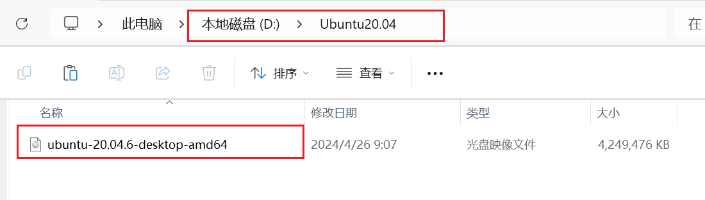

2. 打开Vmware，新建虚拟机

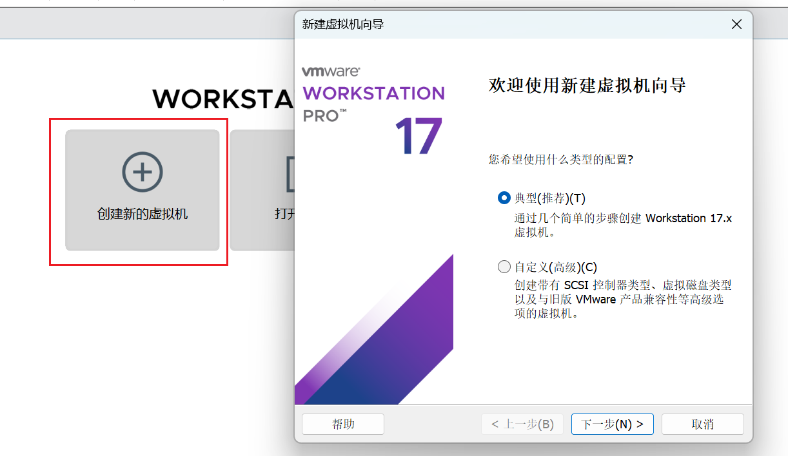

3. 选择Ubuntu镜像

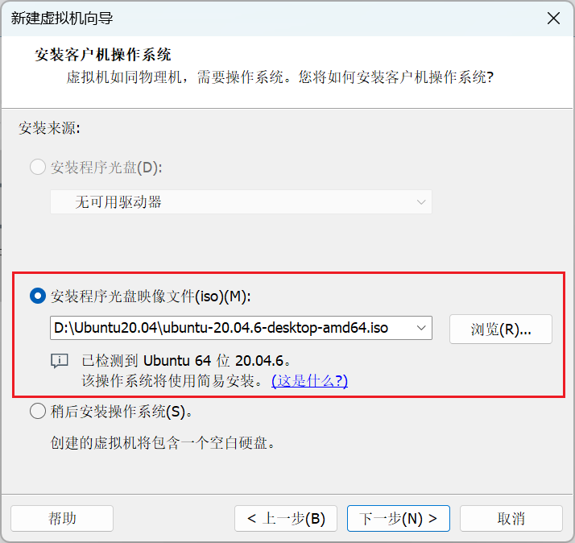

4. 填写Ubuntu账号信息

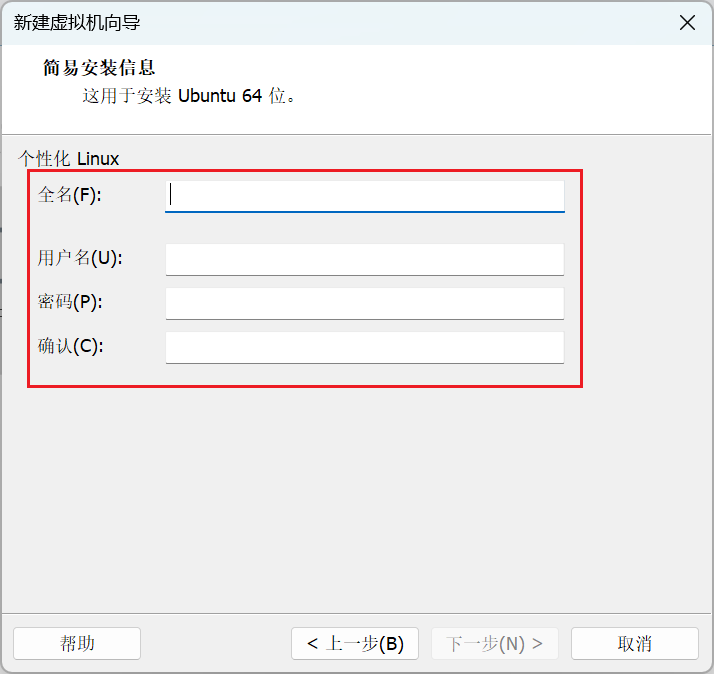

5. 更改虚拟机路径位置

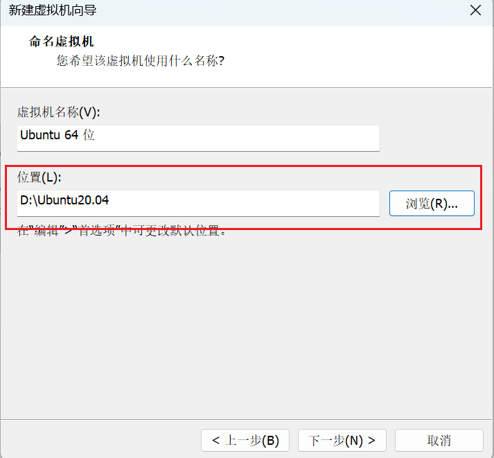

6. 配置虚拟机磁盘
我的电脑为虚拟机单独预留了400G的空间，为此虚拟机最大可分配400G的空间，暂时分配300G，若后期空间不足可以修改虚拟机配置进行修改。本人虚拟机创建后不准备进行移动，所以选择存储为单个文件。

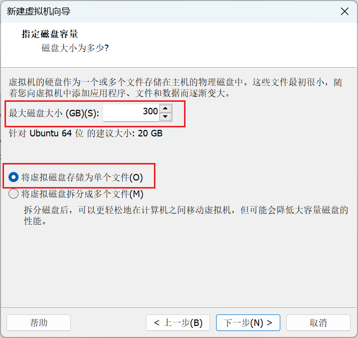

7. 自定义硬件设备

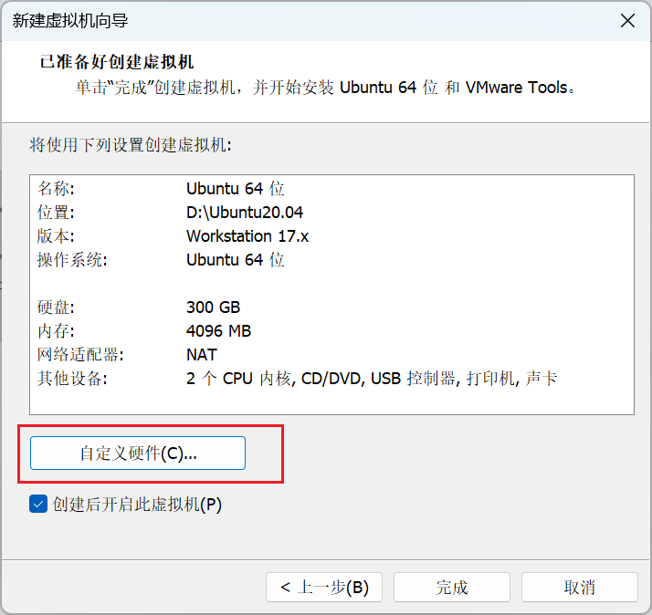

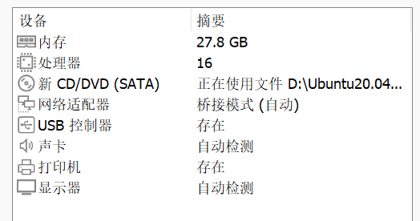

主要配置内存、处理器、网络模式、USB控制器。

* 我的电脑的物理内存是32G，为虚拟机分配了27.8G。
* 我的CPU逻辑处理器共有28个，为虚拟机分配16个。
* 分配的内核总数只能是8的倍数。USB控制器兼容性选择3.1。
* 网络适配器选择桥接模式，涉及到同一网段配置时，会进行详细说明。

8. 等待Ubuntu安装完成，使用刚刚创建的账号进入Ubuntu。

9. 正常情况下，虚拟机会自动安装VMware tools，若没有成功安装，请使用命令行进行安装。依次执行下面的命令。
```
sudo apt-get update
sudo apt-get install open-vm-tools
sudo apt-get install open-vm-tools-desktop
reboot
```
## 中文设置
1. 下载中文

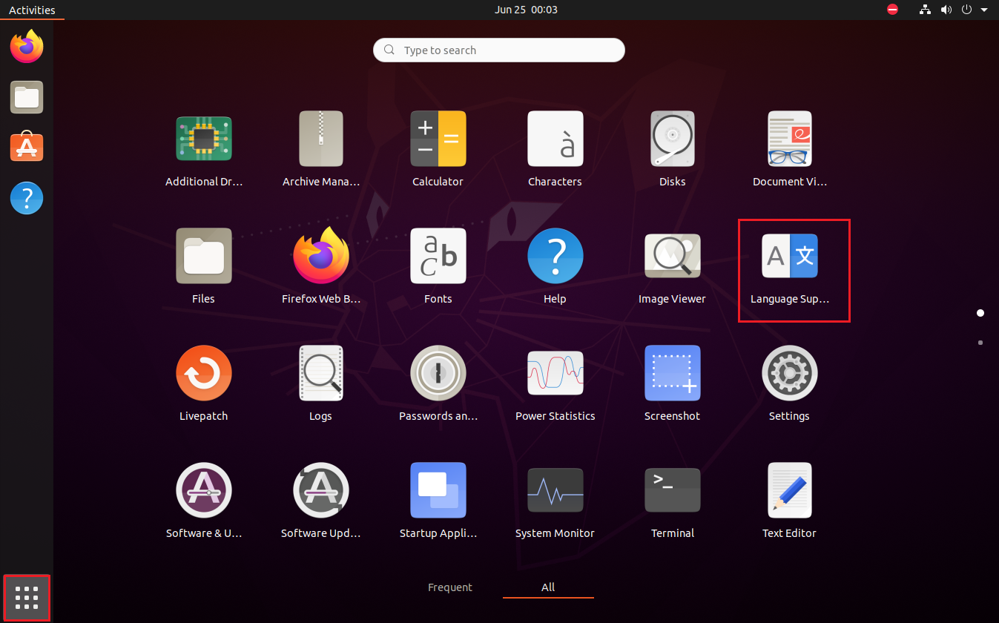

2. 安装中文

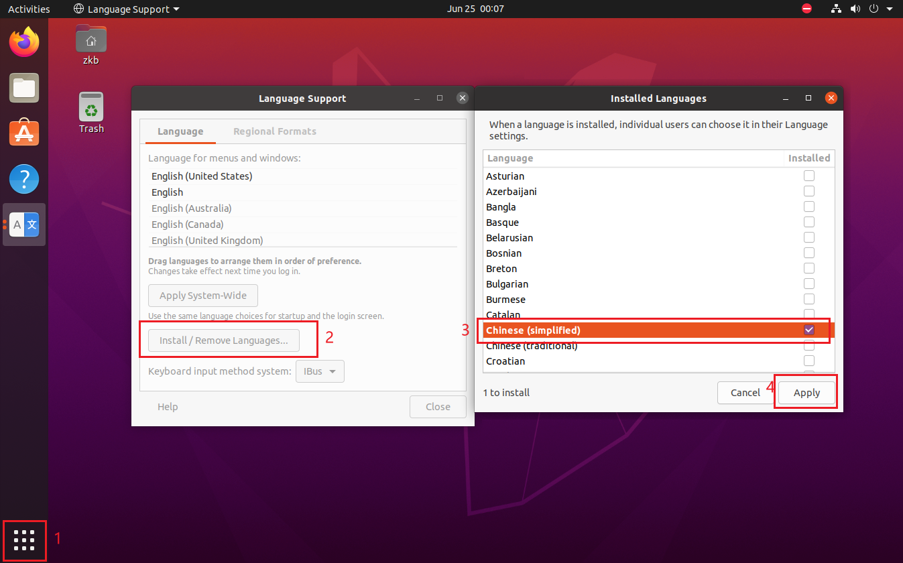

3. 进入设置，在语言管理中添加中文

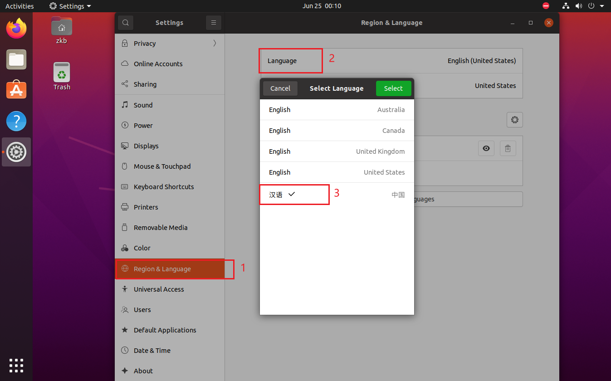

4. 重启

## 更换软件下载源
由于网络的原因，需要将软件下载源更换到国内，否则可能导致下载依赖软件软件包时出现错误。

1. 进入软件中心，点击软件和更新

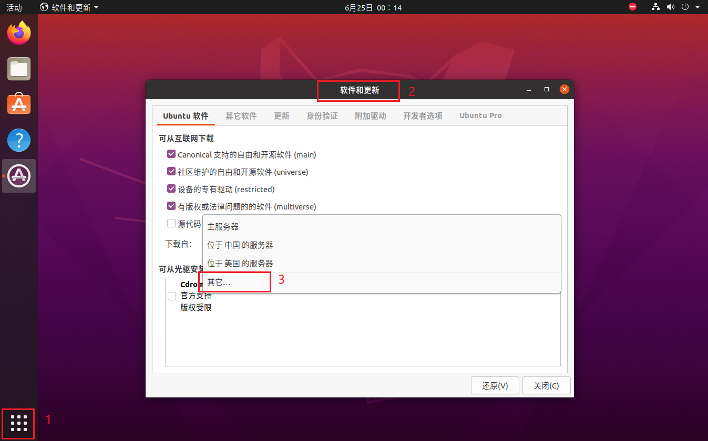

2. 选择下载器，选择阿里云服务器

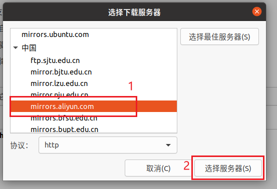

3. 点击关闭，选择重新载入，更新缓存，需要一段时间

## 息屏时间
为了避免一定时间不使用Ubuntu，Ubuntu自动休眠。将Ubuntu长时间运行在后台。

进入设置，选择电源，在节点中选择从不。

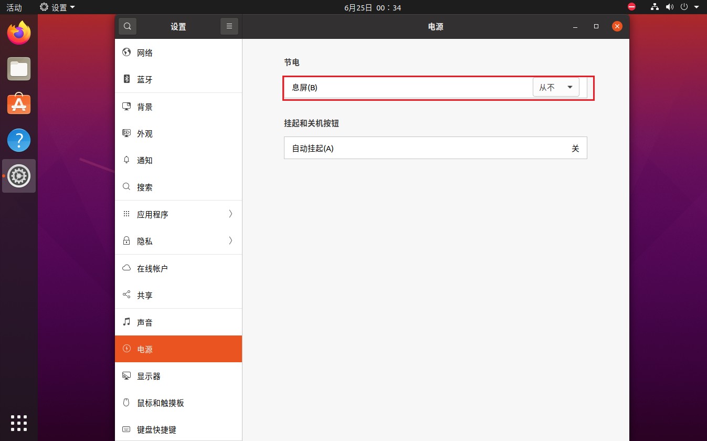
::: info 可能出现的问题1
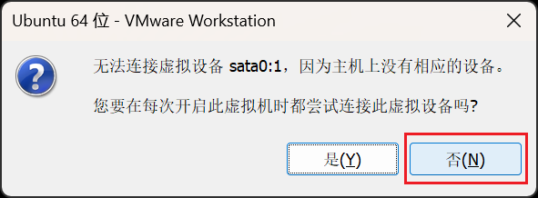
:::