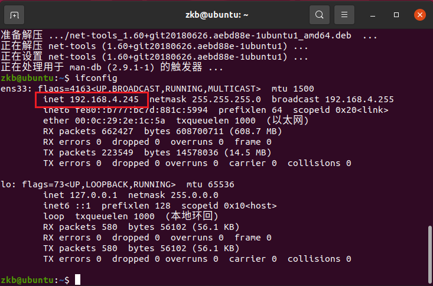
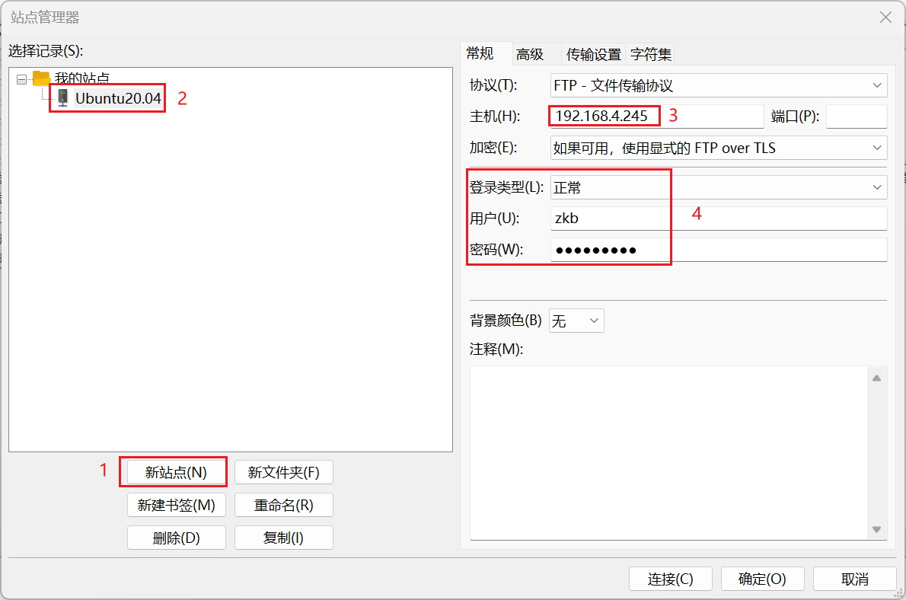
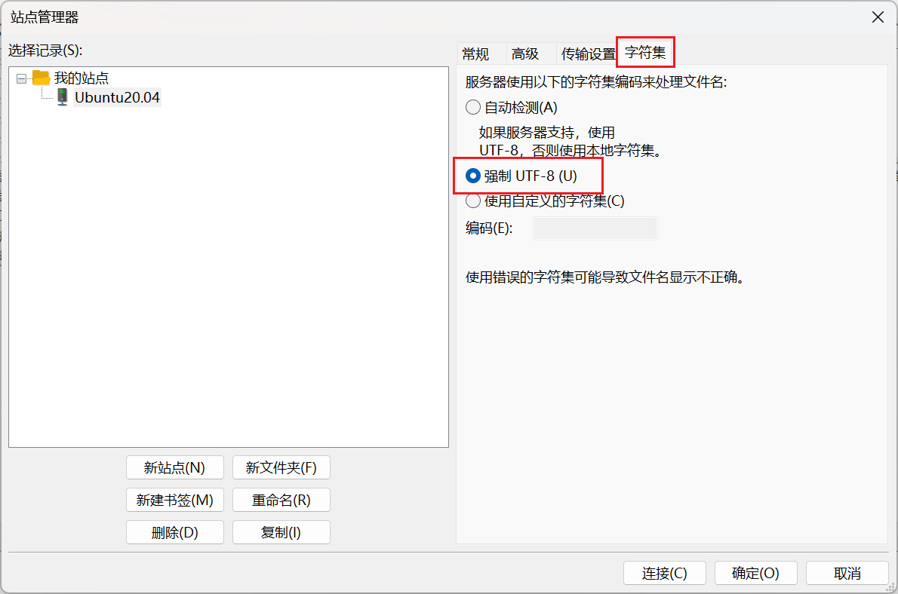
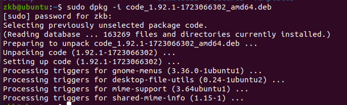
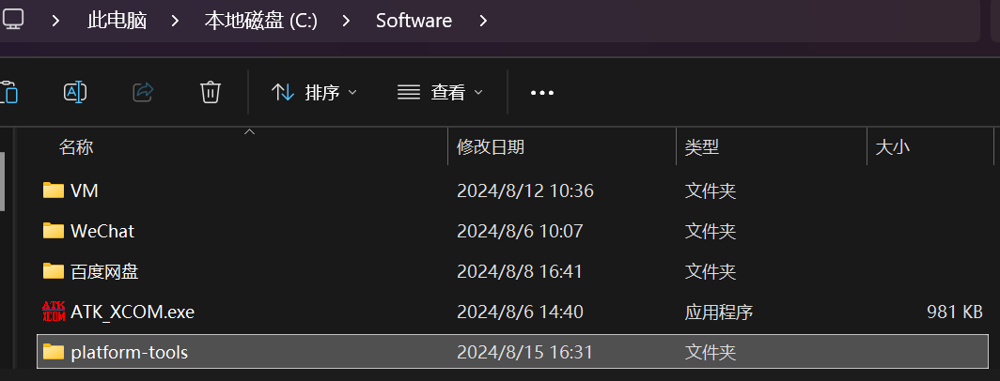
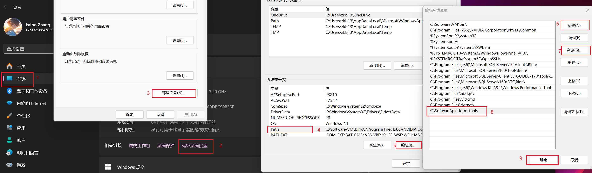
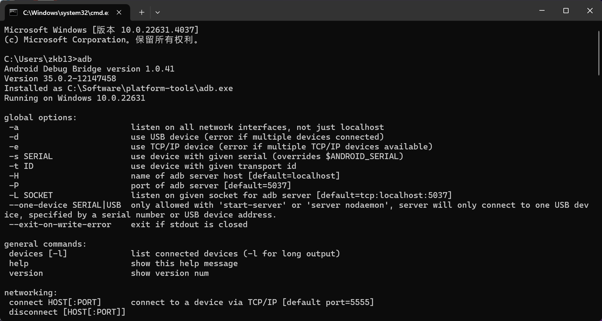
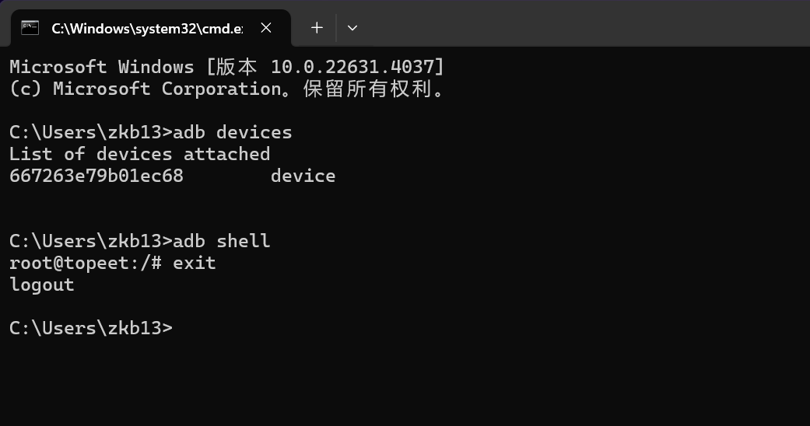

---
# 这是文章的标题
title: 开发工具配置
# 你可以自定义封面图片
cover: /assets/images/cover1.jpg
# 这是页面的图标
icon: file
# 这是侧边栏的顺序
order: 3
# 设置作者
author: 张凯博
# 一个页面可以有多个分类
category:
  - STM32
# 一个页面可以有多个标签
tag:
  - 开发环境
  - 介绍
# 此页面会在文章列表置顶
sticky: false
# 此页面会出现在星标文章中
star: false
# 你可以自定义页脚
footer: STM32开发环境搭建
# 你可以自定义版权信息
copyright: 无版权
---
## FileZilla
FileZilla是用于Windows与Ubuntu之间文件传输的工具，使用此软件需要开启FTP服务器。

虽然VM-tools也可以进行文件的传输，但是对于大文件以及多文件，使用此软件更好。
### FileZilla下载
进入[FileZilla官网下载地址](https://www.filezilla.cn/download/client)，进行软件的下载。下载完成后根据提示进行安装。
### 开启FTP服务器
1. 在Ubuntu中，打开终端，输入`sudo apt-get update`。

```
sudo apt-get update
```

2. 安装vsftpd

```
sudo apt-get install vsftpd 
```

3. 使用 vi 命令打开/etc/vsftpd.conf 配置文件

```
sudo vi /etc/vsftpd.conf 
```

4. 修改配置文件
按下`i`键，进入编辑模式，删除`write_enable=YES`前的`#`。按下`ESC`退出编辑模式，输入`:wq`，按下回车键，完成修改。

5. 输入`sudo /etc/init.d/vsftpd restart`重启服务。

```
sudo /etc/init.d/vsftpd restart
```

6. 安装net-tools
输入`sudo apt install net-tools`.
```
sudo apt install net-tools
```
7. 查看Ubuntu的IP地址

输入`ifconfig`



8. 打开`FileZilla`，点击文件，点击站点管理器，新建站点。
添加Ubuntu。



使用UTF-8编码，防止中文乱码。



9. 连接虚拟机

成功连接到虚拟机，可以进行文件的长传和下载。


## MobaXterm

从官网下载软件。根据提示安装即可。

```component VPCard
title: MobaXterm
desc: MobaXterm官方下载链接
logo: https://github.com/KB-talk/picx-images-hosting/raw/master/picture/1723454975579.73tv6eqvsx.webp
link: https://mobaxterm.mobatek.net/download-home-edition.html
background: rgba(207, 236, 249, 0.5)
```

## Vscode
从官网获取Linux版本安装包，选择`deb`格式。

```component VPCard
title: Vscode
desc: Vscode官方下载链接
logo: https://github.com/KB-talk/picx-images-hosting/raw/master/img/vscode.3tnwnc5rgd80.jpg
link: https://code.visualstudio.com/Download
background: rgba(207, 236, 249, 0.5)
```

将下载的安装包上传到Linux虚拟机中。

打开终端，进入安装包所在目录，输入`sudo dpkg -i vscode.deb`进行安装。例如：

```c
sudo dpkg -i code_1.92.1-1723066302_amd64.deb 
```



打开vscode有两种方法。一种是在终端输入`code`，另一种是在 `应用列表`中打开。

在使用vscode时，不一定在Linux中直接使用，也可以在Windows中通过ssh使用。

在Ubuntu中安装`openssh-server`。

```c
sudo apt-get install openssh-server
```

在window中，点击vscode左下角的`打开远程窗口`，选择`连接主机`，`添加新的SSH主机`，根据自己实际情况输入`ssh 用户名@IP地址 -A`。选择第一个配置，选择Linux，输入密码，即可使用vscode。

```c
ssh zkb@192.168.155.186 -A
```

## RKDevTool

RKDevTool是用于下载固件的软件，将Ubuntu编译好的固件下载到开发板中。

```component VPCard
title: RKDevTool
desc: RKDevTool百度云下载链接，提取码：pesb
logo: https://github.com/KB-talk/picx-images-hosting/raw/master/picture/image.8hgeeqgz0v.webp
link: https://pan.baidu.com/s/1GqSFe6L-ONjxobTBcnJULA?pwd=pesb 
background: rgba(207, 236, 249, 0.5)
```

驱动安装后，将下载的压缩包解压后移动到软件安装目录下，打开直接使用。

编译好的固件在`/home/zkb/RK3588/rk3588-linux/rockdev`中，升级固件为`update.img`。

将此固件下载到Windows中，并使用RKDevTool进行下载。

## ADB

adb是在调试中非常重要的工具，可以使用它进行终端命令的输入以及文件的上传与下载。

1. 从官网下载`adb`压缩包。

```component VPCard
title: ADB
desc: ADB官方下载链接
logo: https://github.com/KB-talk/picx-images-hosting/raw/master/picture/image.32hvw8u11m.webp
link: https://adbdownload.com/
background: rgba(207, 236, 249, 0.5)
```

2. 将下载的压缩包进行解压，将文件夹复制到软件安装目录。



3. 将adb文件夹`platform-tools`，添加到环境变量中。

打开设置 -> 进入系统 -> 打开高级系统设置 -> 打开环境变量 -> 在系统环境变量的Path中添加



4. 测试

在终端中输入`adb`，有信息打印。



5. 使用数据线连接开发板

* 在终端中输入`adb devices`可以查看设备。

```c
adb devices
```

* 使用`adb shell`可以进入开发板，则可以使用终端控制开发板，此终端即开发板的终端。

```c
adb shell
```

* 使用`exit`退出adb，或按下`ctrl+D`，即可退出。

```c
exit
```

