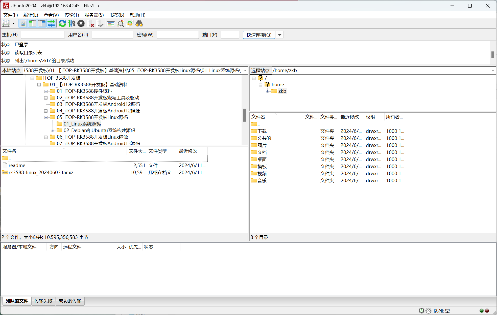

---
# 这是文章的标题
title: 开发工具下载与使用
# 你可以自定义封面图片
cover: /assets/images/cover1.jpg
# 这是页面的图标
icon: file
# 这是侧边栏的顺序
order: 3
# 设置作者
author: 张凯博
# 一个页面可以有多个分类
category:
  - STM32
# 一个页面可以有多个标签
tag:
  - 开发环境
  - 介绍
# 此页面会在文章列表置顶
sticky: false
# 此页面会出现在星标文章中
star: false
# 你可以自定义页脚
footer: STM32开发环境搭建
# 你可以自定义版权信息
copyright: 无版权
---
## FileZilla
FileZilla是用于Windows与Ubuntu之间文件传输的工具，使用此软件需要开启FTP服务器。

虽然VM-tools也可以进行文件的传输，但是对于大文件以及多文件，使用此软件更好。
### FileZilla下载
进入[FileZilla官网下载地址](https://www.filezilla.cn/download/client)，进行软件的下载。下载完成后根据提示进行安装。
### 开启FTP服务器
1. 在Ubuntu中，打开终端，输入`sudo apt-get update`。

```
sudo apt-get update
```

2. 安装vsftpd

```
sudo apt-get install vsftpd 
```

3. 使用 vi 命令打开/etc/vsftpd.conf 配置文件

```
sudo vi /etc/vsftpd.conf 
```

4. 修改配置文件
按下`i`键，进入编辑模式，删除`write_enable=YES`前的`#`。按下`ESC`退出编辑模式，输入`:wq`，按下回车键，完成修改。

5. 输入`sudo /etc/init.d/vsftpd restart`重启服务。

```
sudo /etc/init.d/vsftpd restart
```

6. 安装net-tools
输入`sudo apt install net-tools`.
```
sudo apt install net-tools
```
7. 查看Ubuntu的IP地址

输入`ifconfig`


8. 打开`FileZilla`，点击文件，点击站点管理器，新建站点。
添加Ubuntu。


使用UTF-8编码，防止中文乱码。


9. 连接虚拟机

成功连接到虚拟机，可以进行文件的长传和下载。


## MobaXterm

## Vscode

## RKDevTool

## ADB
