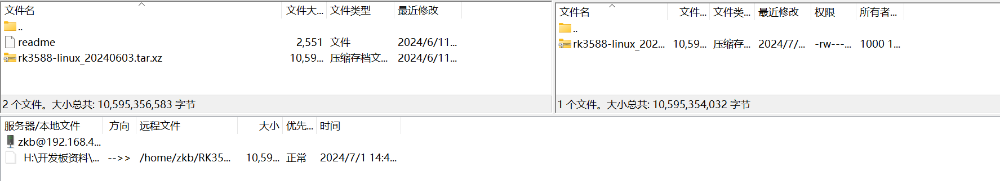

---
# 这是文章的标题
title: SDK介绍
# 你可以自定义封面图片
cover: /assets/images/cover1.jpg
# 这是页面的图标
icon: file
# 这是侧边栏的顺序
order: 1
# 设置作者
author: 张凯博
# 设置写作时间
date: 2024-06-21
# 一个页面可以有多个分类
category:
  - STM32
# 一个页面可以有多个标签
tag:
  - 开发环境
  - 介绍
# 此页面会在文章列表置顶
sticky: false
# 此页面会出现在星标文章中
star: false
# 你可以自定义页脚
footer: STM32开发环境搭建
# 你可以自定义版权信息
copyright: 无版权
---
## RK3588 Linux SDK介绍
RK3588 Linux SDK 集成了 Linux Kernel 源码、U-Boot 源码以及 RK 提供的各种开发工具、文档等。

## SDK获取与编译
瑞芯微的SDK包并不开源，获取最新的SDK包需要从开发板的厂商处进行获取，下载后使用Filezila将安装包上传到Ubuntu虚拟机中。

1. 新建文件夹

```
mkdir RK3588
```

2. 将SDK压缩包上传到RK3588文件夹中

3. 使用命令解压SDK包
解压`RK3588`SDK包
```
tar -vxf rk3588-linux_20240603.tar.xz
```
解压`RV1126`SDK包
```
tar -vxf atk-rv1126_linux_release_v1.5_20240201.tar.bz2
```

4. 转到解压出的文件夹中，进行第一次全自动编译

```
./build.sh
```
::: note
第一次编译时，会下载一些依赖。
:::

## SDK工程目录介绍
⼀个通⽤Linux SDK⼯程⽬录包含有buildroot、debian、app、kernel、u-boot、device、docs、external等⽬录。
* app：存放上层应⽤APP，主要是⼀些应⽤Demo。
* buildroot：存放 Buildroot 开发的根⽂件系统。
* debian：存放 Debian 开发的根⽂件系统。
* device/rockchip：存放芯⽚板级配置以及⼀些编译和打包固件的脚本和⽂件。docs：存放通⽤开发指导⽂档、Linux系统开发指南、芯⽚平台相关⽂档等。external：存放第三⽅相关仓库，包括显⽰、⾳视频、摄像头、⽹络、安全等。kernel：存放 Kernel 开发的代码。
* output：存放每次⽣成的固件信息、编译信息、XML、主机环境等。prebuilts：存放交叉编译⼯具链。
* rkbin：存放 Rockchip 相关⼆进制和⼯具。
* rockdev：存放编译输出固件，实际软链接到 output/firmware 。
* tools：存放 Linux 和 Window 操作系统下常⽤⼯具。
* u-boot：存放基于 v2017.09 版本进⾏开发的 U-Boot 代码。
* yocto：存放Yocto开发的根⽂件系统。
