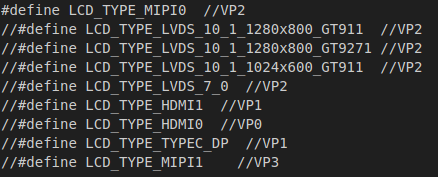
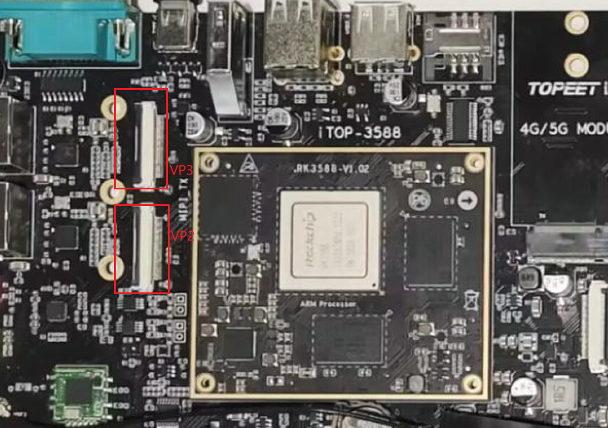

---
# 这是文章的标题
title: 屏幕及摄像头配置
# 你可以自定义封面图片
cover: /assets/images/cover1.jpg
# 这是页面的图标
icon: file
# 这是侧边栏的顺序
order: 1
# 设置作者
author: 张凯博
# 设置写作时间
date: 2024-06-21
# 一个页面可以有多个分类
category:
  - STM32
# 一个页面可以有多个标签
tag:
  - 开发环境
  - 介绍
# 此页面会在文章列表置顶
sticky: false
# 此页面会出现在星标文章中
star: false
# 你可以自定义页脚
footer: STM32开发环境搭建
# 你可以自定义版权信息
copyright: 无版权
---

## 配置屏幕

开发板配套的屏幕是`迅为7寸屏幕`。

1. 修改`/home/zkb/RK3588/rk3588-linux/kernel/arch/arm64/boot/dts/rockchip`中的`topeet_screen_lcds.dts`。选择屏幕列表中的屏幕，VP2合VP3使用的都是MIPI屏幕，对应的接口不同。

我们选择`#define LCD_TYPE_MIPI0  //VP2`将其他屏幕注释。

2. 修改`/home/zkb/RK3588/rk3588-linux/kernel/arch/arm64/configs`中的`rockchip_linux_defconfig`。在使用MIPI屏幕时，需要确保`CONFIG_DRM_MIPI_DSI=y`被使能。

## 配置摄像头

1. 修改`/home/zkb/RK3588/rk3588-linux/kernel/arch/arm64/boot/dts/rockchip/topeet_camera_config.dtsi`,选择使用的接口。

2. 修改`/home/zkb/RK3588/rk3588-linux/kernel/arch/arm64/configs/rockchip_linux_defconfig`。使能对应的摄像头。