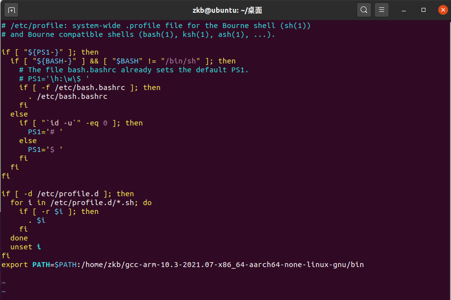
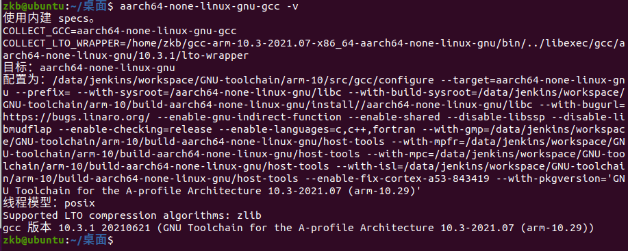

---
# 这是文章的标题
title: 驱动开发介绍
# 你可以自定义封面图片
cover: /assets/images/cover1.jpg
# 这是页面的图标
icon: file
# 这是侧边栏的顺序
order: 1
# 设置作者
author: 张凯博
# 设置写作时间
date: 2024-06-21
# 一个页面可以有多个分类
category:
  - STM32
# 一个页面可以有多个标签
tag:
  - 开发环境
  - 介绍
# 此页面会在文章列表置顶
sticky: false
# 此页面会出现在星标文章中
star: false
# 你可以自定义页脚
footer: STM32开发环境搭建
# 你可以自定义版权信息
copyright: 无版权
---
## 驱动分类

驱动主要分为字符类驱动、块驱动、网络驱动。

## 开发环境搭建

```component VPCard
title: gcc下载链接
desc: 提取码 jmb1
logo: https://github.com/KB-talk/picx-images-hosting/raw/master/picture/image.7w6rjj6ddu.webp
link: https://pan.baidu.com/s/142PGsDB6nXy6tF68VUVbjg?pwd=jmb1
background: rgba(207, 236, 249, 0.5)
```


1. 将[交叉编译器](https://github.com/KB-talk/picx-images-hosting/raw/master/picture/image.7w6rjj6ddu.webp)拷贝到Ubuntu中。

2. 使用命令解压。

```c
sudo tar -vxf gcc-arm-10.3-2021.07-x86_64-aarch64-none-linux-gnu.tar.gz
```

3. 在终端输入`sudo vi /etc/profile`。

```c
sudo vi /etc/profile
```

4. 在最后，将变量添加环境变量中。

```c
export PATH=$PATH:/home/zkb/gcc-arm-10.3-2021.07-x86_64-aarch64-none-linux-gnu/bin
```



5. 重启系统，在终端输入`aarch64-none-linux-gnu-gcc -v`。

```c
aarch64-none-linux-gnu-gcc -v
```


