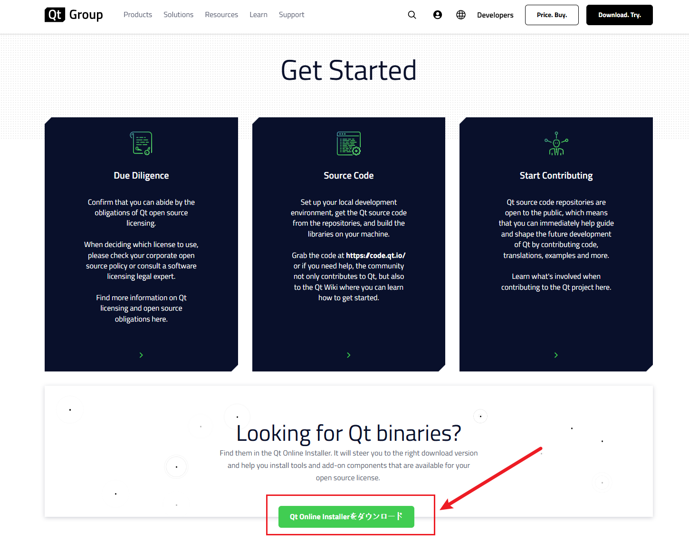
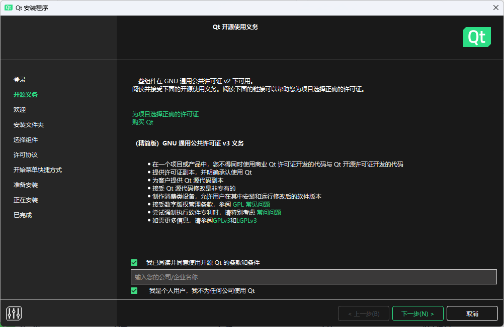
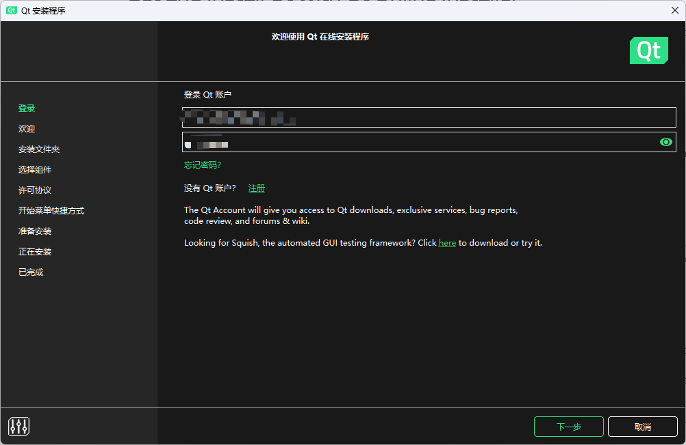
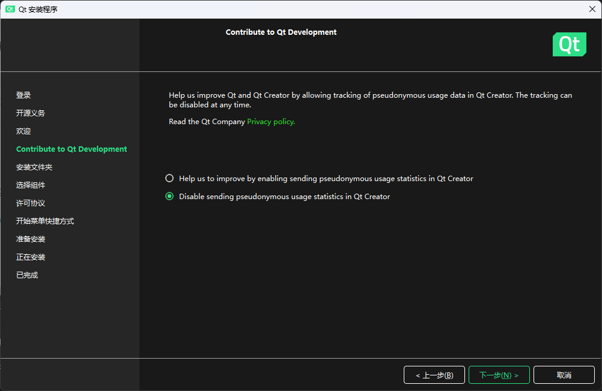
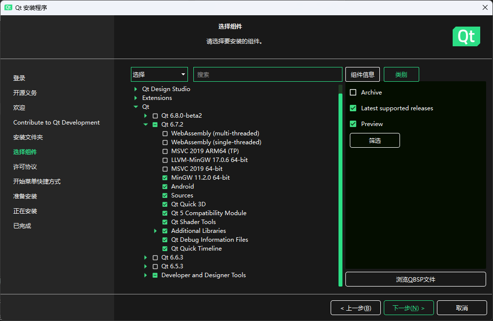

---
# 这是文章的标题
title: 开发环境
# 你可以自定义封面图片
cover: /assets/images/cover1.jpg
# 这是页面的图标
icon: file
# 这是侧边栏的顺序
order: 1
# 设置作者
author: 张凯博
# 设置写作时间
date: 2024-06-21
# 一个页面可以有多个分类
category:
  - STM32
# 一个页面可以有多个标签
tag:
  - 开发环境
  - 介绍
# 此页面会在文章列表置顶
sticky: false
# 此页面会出现在星标文章中
star: false
# 你可以自定义页脚
footer: STM32开发环境搭建
# 你可以自定义版权信息
copyright: 无版权
---
## Qt安装包的下载
 从官网获取安装包，在下载安装包时一定选择开源版本，否则只会有10天试用权，重新安装也解决不了。注册的账号就报废了。

```component VPCard
title: Qt开源版
desc: Qt开源版本官方下载链接
logo: https://github.com/KB-talk/picx-images-hosting/raw/master/img/image.3yecsuqn1d.webp
link: https://www.qt.io/download-open-source
background: rgba(207, 236, 249, 0.5)
```

在此处点击下载，下载安装包。



 ## 安装Qtcreater

1. 运行安装包

2. 注册Qt账号
在注册账号的时候一定选择`我是个人，没有为任何公司使用Qt`。

3. 填入Qt账号







4. 选择安装路径

安装路径不允许有中文

5. 选择组件



::: tip 

在下载安装时可能出现报错的情况，通常是因为下载速度慢导致的，可以点击重试，或者换个网络环境再下载。

:::
