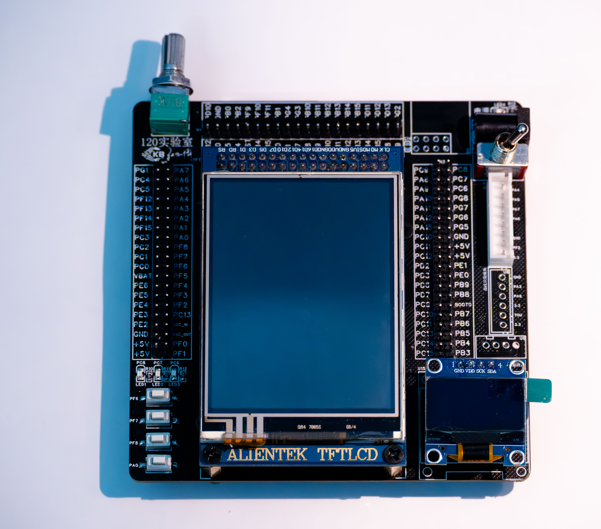
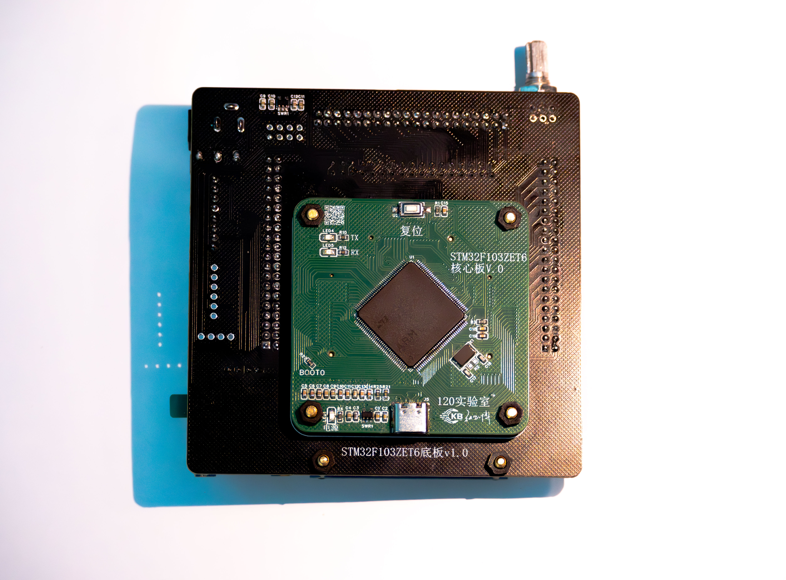

---
# 这是文章的标题
title: 开发板介绍
# 你可以自定义封面图片
cover: /assets/images/cover1.jpg
# 这是页面的图标
icon: file
# 这是侧边栏的顺序
order: 1
# 设置作者
author: 张凯博
# 设置写作时间
date: 2024-06-26
# 一个页面可以有多个分类
category:
  - STM32
# 一个页面可以有多个标签
tag:
  - 开发环境
  - 介绍
# 此页面会在文章列表置顶
sticky: false
# 此页面会出现在星标文章中
star: false
# 你可以自定义页脚
footer: STM32开发环境搭建
# 你可以自定义版权信息
copyright: 无版权
---
::: tip 特殊声明

此系列文档，侧重于功能的实现，会省略原理部分。

由于STM32的常用外设目前教程较多、非常丰富，需要原理学习的自行百度，或参考正点原子及野火的教程。

:::
## 开发板介绍
本系列文章使用的是120实验室设计并制作的STM32开发板，此开发板由核心板与底板两部分组成。

## 核心板介绍
核心板采用STM32F103ZET6作为主控，此款芯片对于入门STM32学习很友好，拥有丰富的硬件资源，基本包含了单片机项目常用的功能。学习此芯片后，可以完成大部分STM32的任务。基于HAL库可以很快速的设用其他型号芯片。

在使用单片机的过程中，最基本的操作是下载和调试程序。在核心板中集成了ST-link下载器，无需额外连接下载器。核心板同时拥有串口调试功能，使用USB连接线连接电脑，即可进行程序的下载和。

## 底板介绍
配套的底版为第一版，包含了常用的一些功能，如LCD、OLED、RTC、按键、LED、蜂鸣器、RC522读卡器等功能。且将STM32芯片的引脚全部引出，方便后续调试其他模块时使用。此底板在设计时，忽略了电源的引出，若需要添加其他模块，可以设计其他底板或通过PCB引脚引出电源。

使用此底板即可学习STM32大部分的功能，如GPIO、iic、spi、串口、adc、pwm等常用外设。

## 开发环境的介绍
STM32的开发环境有很多，以前Keil5一家独大，部分开发者会使用Vscode通过安装插件的方式进行开发，由于近些年HAL的快速发展，逐渐的淘汰了标准库函数的开发模式，均采用HAL库进行开发。

在使用HAL库时，正点原子初期课程虽然将库函数转变为HAL开发，但是仍继承了传统的思路，并没有发挥HAL的优点。

通过使用STM32CubeMX配置STM32工程，可以大大降低STM32的学习难度，降低了STM32配置引脚的难度。如将GPIO配置为输入模式，最简单的功能，在开始学习时仍有很大的出错的概率，且过程较为麻烦。使用CubeMX软件进行配置，只需通过图形化界面进行配置即可，基本上不会出现问题。

## 开发板测试
开发板默认下载了测试程序。

使用一根可以传输数据的type-c数据线，将开发板与电脑进行连接。

## 参考资料
* 120实验室STM32F103ZET6核心板电路图
* 120实验室STM32F103ZET6_V1.0底板电路图
* [正点原子资料下载](http://47.111.11.73/docs/boards/stm32/zdyz_stm32f103_warshipV4.html)
* [STM32动画视频教程推荐](https://www.bilibili.com/video/BV12v4y1y7uV/?spm_id_from=333.999.0.0&vd_source=7bc61b3be57793288420595a48ac0104)

---
::: info 

文档在编辑过程中比较仓促，若发现什么错误可以在评论区进行留言或与我联系，对文档进行更新。

:::