---
# 这是文章的标题
title: 新建工程
# 你可以自定义封面图片
cover: /assets/images/cover1.jpg
# 这是页面的图标
icon: file
# 这是侧边栏的顺序
order: 3
# 设置作者
author: 张凯博
# 设置写作时间
date: 2024-06-21
# 一个页面可以有多个分类
category:
  - STM32
# 一个页面可以有多个标签
tag:
  - 开发环境
  - 介绍
# 此页面会在文章列表置顶
sticky: false
# 此页面会出现在星标文章中
star: false
# 你可以自定义页脚
footer: STM32开发环境搭建
# 你可以自定义版权信息
copyright: 无版权
---
## 创建工程
1. 创建一个新工程

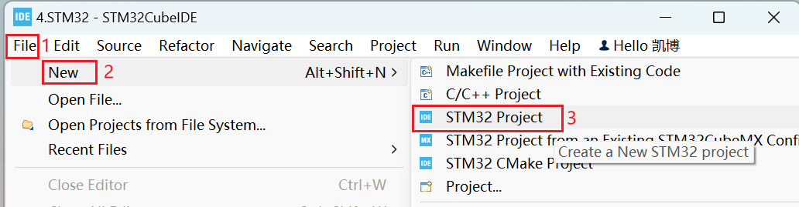

2. 选择芯片

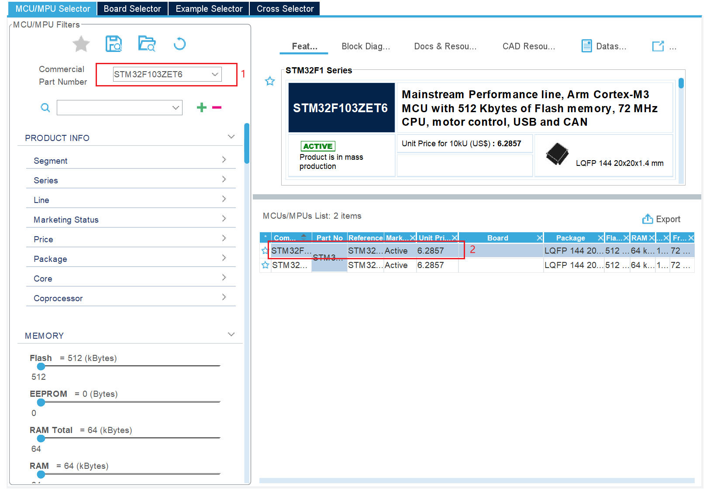

在选择芯片时，使用英文输入法进行输入，否侧会出现连按的现象。

3. 输入工程名

点击`完成`后，点击`yes`。会自动下载需要的工具。

4. 进入工程配置界面

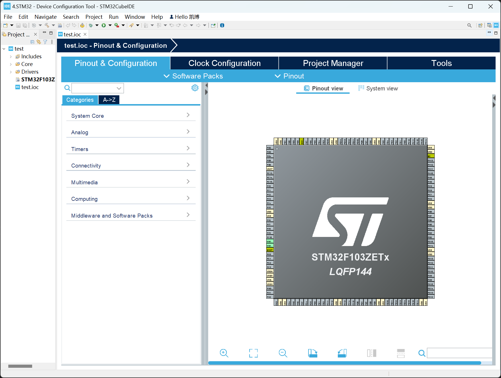

## 配置下载器

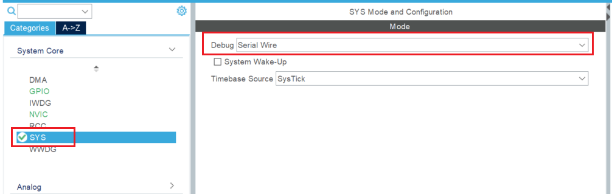

## 配置时钟树
1. 选择晶振

选择外部石英晶振

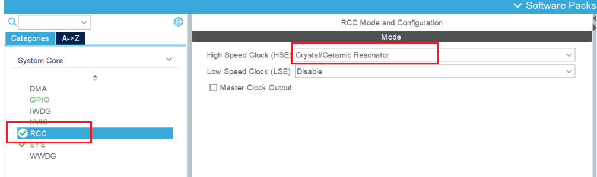

2. 配置时钟树

在`HCLK`处，输入72，软件会自动计算每部分，无需自己单独配置。

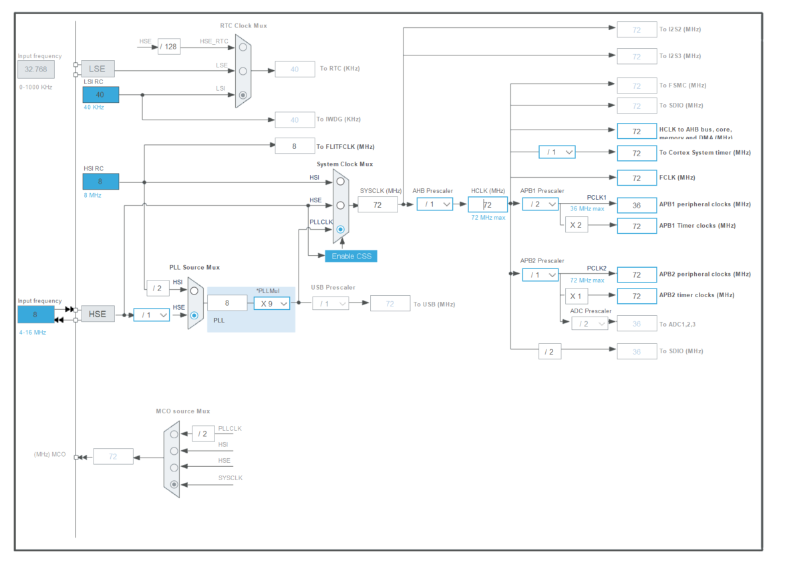

## 配置工程选项

生成独立的文件

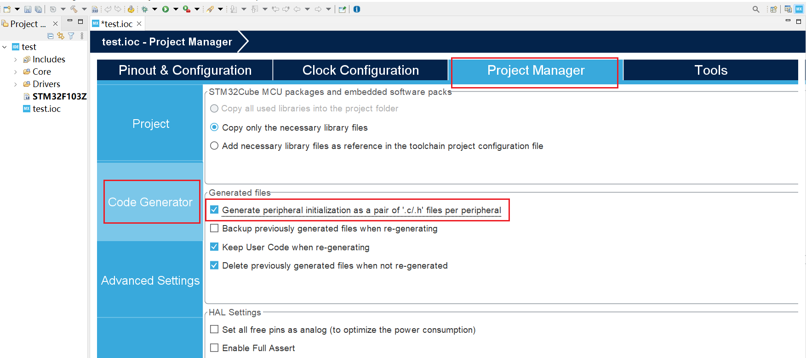

## 生成工程配置代码

经过上面的配置，可以配置出最基本的工程，其中不包含任何功能。

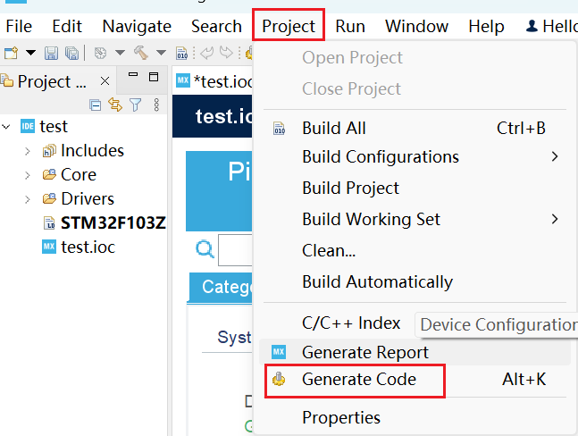

## 下载器的选择

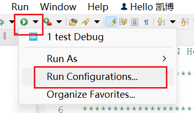

注意下面这些地方，其中`Enable live expression`关闭，此核心板关闭\打开都可以进行下载。若使用其他ST-Link或国产芯片可能无法下载，若遇到下载问题可尝试更改上面位置。

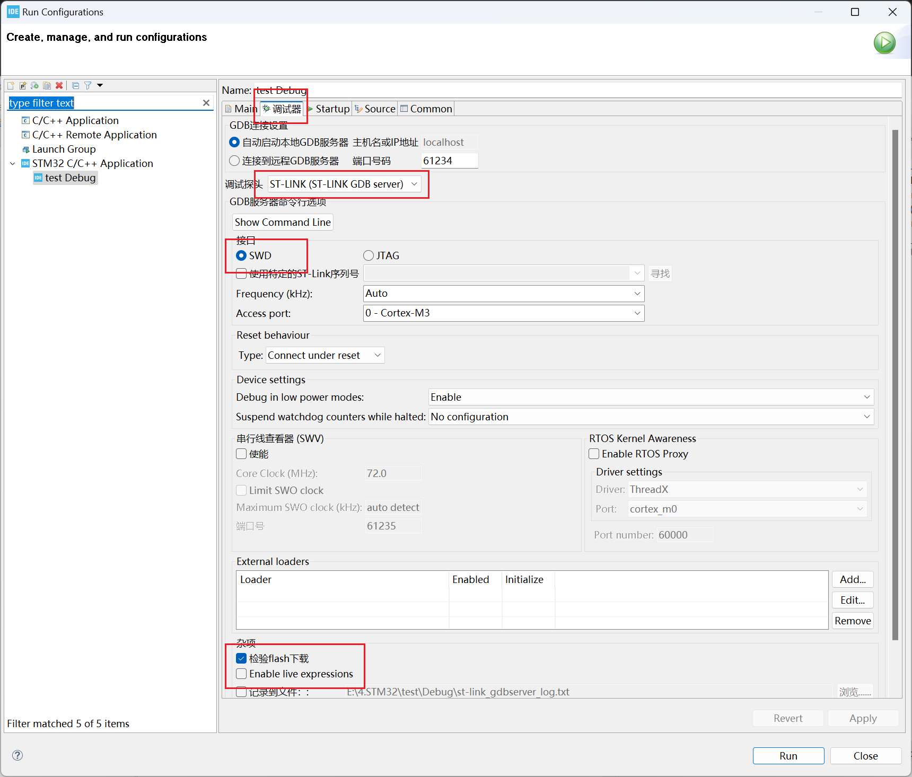

## 下载程序

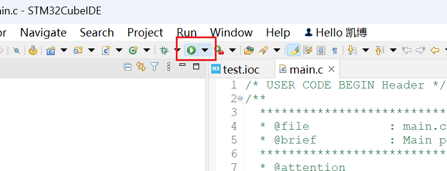

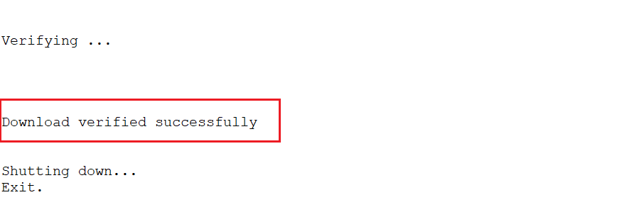