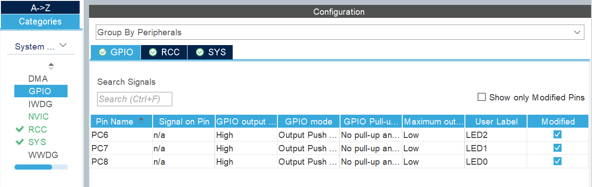
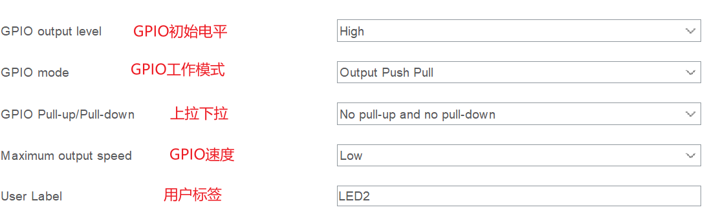

---
# 这是文章的标题
title: 工程配置
# 你可以自定义封面图片
cover: /assets/images/cover1.jpg
# 这是页面的图标
icon: file
# 这是侧边栏的顺序
order: 2
# 设置作者
author: 张凯博
# 设置写作时间
date: 2024-06-21
# 一个页面可以有多个分类
category:
  - STM32
# 一个页面可以有多个标签
tag:
  - 开发环境
  - 介绍
# 此页面会在文章列表置顶
sticky: false
# 此页面会出现在星标文章中
star: false
# 你可以自定义页脚
footer: STM32开发环境搭建
# 你可以自定义版权信息
copyright: 无版权
---
::: tip

从本章开始，工程配置只强调核心内容，不再配置下载器、时钟、工程管理部分，如有需要请查看开发环境搭建中的工程配置。

:::

## 配置引脚信息
在芯片图形界面中，找到需要配置的IO，将IO配置为输出模式。

下面解释一下有关推挽输出模式下的GPIO的参数设置。

* 首先配置GPIO的初始电平为高电平。

* GPIO工作模式选择推挽输出。

* 上拉下拉选择浮空。

* GPIO速度选择低速，高速低速对于此实验无影响。

* 设置自定义标签。

