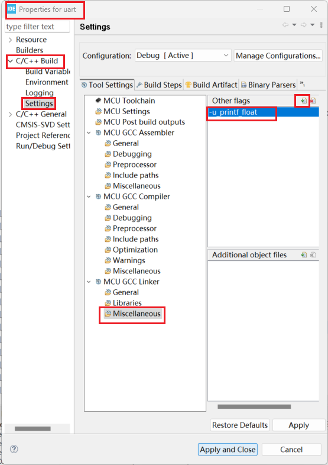

---
# 这是文章的标题
title: 程序设计
# 你可以自定义封面图片
cover: /assets/images/cover1.jpg
# 这是页面的图标
icon: file
# 这是侧边栏的顺序
order: 3
# 设置作者
author: 张凯博
# 设置写作时间
date: 2024-06-21
# 一个页面可以有多个分类
category:
  - STM32
# 一个页面可以有多个标签
tag:
  - 开发环境
  - 介绍
# 此页面会在文章列表置顶
sticky: false
# 此页面会出现在星标文章中
star: false
# 你可以自定义页脚
footer: STM32开发环境搭建
# 你可以自定义版权信息
copyright: 无版权
---
## 串口重定向
在使用串口进行打印信息时，在HAL中是比较复杂的，原函数为`HAL_UART_Transmit(&huart1, "hello Windows\n", 15,0xFFFF);`。在使用过程比较麻烦，我们希望使用`printf("hello\r\n");`进行打印信息，这样会简化使用过程。这时候就需要进行串口重定向。

1. 修改usart.h文件
在usart.h中添加`#include "stdio.h"`头文件。

```c
/* USER CODE BEGIN Includes */
#include "stdio.h"
/* USER CODE END Includes */
```

2. 修改usart.c文件
```c
/* USER CODE BEGIN 0 */
/* 串口重定向 */
#ifdef __GNUC__
#define PUTCHAR_PROTOTYPE int __io_putchar(int ch)
#else
#define PUTCHAR_PROTOTYPE int fputc(int ch, FILE *f)
#endif
PUTCHAR_PROTOTYPE
{
HAL_UART_Transmit(&huart1, (uint8_t*)&ch, 1, HAL_MAX_DELAY); return ch;
}
/* USER CODE END 0 */
```

3. 使用printf进行发送 
在main.c中的主函数添加printf("hello\r\n");
```c
/* USER CODE BEGIN 3 */
printf("hello\r\n");
HAL_Delay(1000);
```

::: tip
使用printf进行发送时，尽量在末尾加上换行符`\r\n`。
:::

4. 测试
使用串口助手查看

## 串口中断
上面介绍的串口重定向是用于使用STM32向外发送消息，而串口串口中断是用于接受消息。

1. 修改usart.h文件
添加`#include "string.h"`
```c
/* USER CODE BEGIN Includes */
#include "stdio.h"
#include "string.h"
/* USER CODE END Includes */
```

```c
/* USER CODE BEGIN Private defines */
#define RXBUFFERSIZE  256     //最大接收字节数
/* USER CODE END Private defines */
```
2. 修改usart.c
定义变量
```c
/* USER CODE BEGIN 0 */
char RxBuffer[RXBUFFERSIZE];  //接收数据
uint8_t aRxBuffer;			      //接收中断缓冲
uint8_t Uart1_Rx_Cnt = 0;     //接收缓冲计数
/* USER CODE END 0 */
```

添加中断函数
```c
/* USER CODE BEGIN 1 */
void HAL_UART_RxCpltCallback(UART_HandleTypeDef *huart)
{
  /* Prevent unused argument(s) compilation warning */
  UNUSED(huart);
  /* NOTE: This function Should not be modified, when the callback is needed,
           the HAL_UART_TxCpltCallback could be implemented in the user file
   */

	if(Uart1_Rx_Cnt >= 255)  //溢出判断
	{
		Uart1_Rx_Cnt = 0;
		memset(RxBuffer,0x00,sizeof(RxBuffer));
		HAL_UART_Transmit(&huart1, (uint8_t *)"数据溢出", 10,0xFFFF);
	}
	else
	{
		RxBuffer[Uart1_Rx_Cnt++] = aRxBuffer;

		if((RxBuffer[Uart1_Rx_Cnt-1] == 0x0A)&&(RxBuffer[Uart1_Rx_Cnt-2] == 0x0D)) //判断结束位
		{
			HAL_UART_Transmit(&huart1, (uint8_t *)&RxBuffer, Uart1_Rx_Cnt,0xFFFF); //将收到的信息发送出去
			Uart1_Rx_Cnt = 0;
			memset(RxBuffer,0x00,sizeof(RxBuffer)); //清空数组
		}
	}

	HAL_UART_Receive_IT(&huart1, (uint8_t *)&aRxBuffer, 1);   //因为接收中断使用了一次即关闭，所以在最后加入这行代码即可实现无限使用
}
/* USER CODE END 1 */
```
3. 在main.c中的主函数中添加中断函数。

* 在main.c中访问外部变量。
```c
/* USER CODE BEGIN PV */
extern uint8_t aRxBuffer;
/* USER CODE END PV */
```

* 在串口初始化后添加
```c
/* USER CODE BEGIN 2 */
  HAL_UART_Receive_IT(&huart1, (uint8_t *)&aRxBuffer, 1);
  /* USER CODE END 2 */
```

## 串口重映射及串口中断
### usart.c
```c
#ifdef __GNUC__
#define PUTCHAR_PROTOTYPE int __io_putchar(int ch)
#else
#define PUTCHAR_PROTOTYPE int fputc(int ch, FILE *f)
#endif
PUTCHAR_PROTOTYPE
{
HAL_UART_Transmit(&huart1, (uint8_t*)&ch, 1, HAL_MAX_DELAY); return ch;
}

char RxBuffer[RXBUFFERSIZE];  //接收数据
uint8_t aRxBuffer;			      //接收中断缓冲
uint8_t Uart1_Rx_Cnt = 0;     //接收缓冲计数
```

```c
void HAL_UART_RxCpltCallback(UART_HandleTypeDef *huart)
{
  /* Prevent unused argument(s) compilation warning */
  UNUSED(huart);
  /* NOTE: This function Should not be modified, when the callback is needed,
           the HAL_UART_TxCpltCallback could be implemented in the user file
   */

	if(Uart1_Rx_Cnt >= 255)  //溢出判断
	{
		Uart1_Rx_Cnt = 0;
		memset(RxBuffer,0x00,sizeof(RxBuffer));
		HAL_UART_Transmit(&huart1, (uint8_t *)"数据溢出", 10,0xFFFF);
	}
	else
	{
		RxBuffer[Uart1_Rx_Cnt++] = aRxBuffer;

		if((RxBuffer[Uart1_Rx_Cnt-1] == 0x0A)&&(RxBuffer[Uart1_Rx_Cnt-2] == 0x0D)) //判断结束位
		{
			HAL_UART_Transmit(&huart1, (uint8_t *)&RxBuffer, Uart1_Rx_Cnt,0xFFFF); //将收到的信息发送出去
			Uart1_Rx_Cnt = 0;
			memset(RxBuffer,0x00,sizeof(RxBuffer)); //清空数组
		}
	}

	HAL_UART_Receive_IT(&huart1, (uint8_t *)&aRxBuffer, 1);   //因为接收中断使用了一次即关闭，所以在最后加入这行代码即可实现无限使用
}
```
### usart.h
```c
#include "stdio.h"
#include "string.h"
```

```c
#define RXBUFFERSIZE  256     //最大接收字节数
```

### main.c
```c
extern uint8_t aRxBuffer;
```
```c
HAL_UART_Receive_IT(&huart1, (uint8_t *)&aRxBuffer, 1);
```
## 支持输出中文和浮点
鼠标在工程右键，选择properties。

### 支持浮点



```c
-u_printf_float
```

### 支持中文


在选项中没有，手动输入即可。

