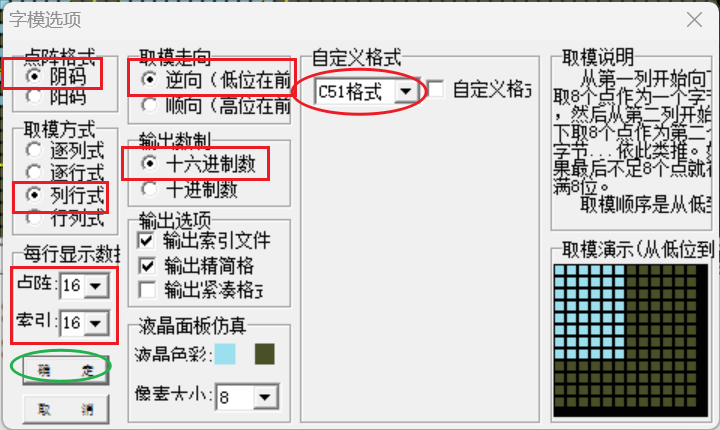
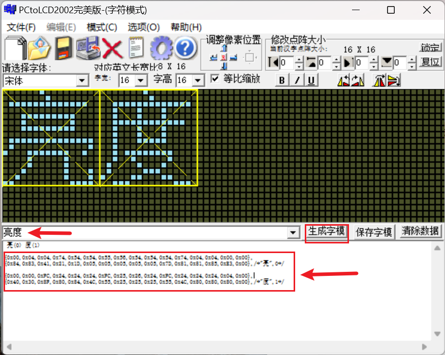

---
# 这是文章的标题
title: 程序设计
# 你可以自定义封面图片
cover: /assets/images/cover1.jpg
# 这是页面的图标
icon: file
# 这是侧边栏的顺序
order: 3
# 设置作者
author: 张凯博
# 设置写作时间
date: 2024-06-21
# 一个页面可以有多个分类
category:
  - STM32
# 一个页面可以有多个标签
tag:
  - 开发环境
  - 介绍
# 此页面会在文章列表置顶
sticky: false
# 此页面会出现在星标文章中
star: false
# 你可以自定义页脚
footer: STM32开发环境搭建
# 你可以自定义版权信息
copyright: 无版权
---

## 在BSP文件夹中新建OLED文件夹
### 新建oled.c文件
```c
#include "oled.h"
#include "stdlib.h"
#include "oledfont.h"
#include "i2c.h"
/**********************************************************
 * 初始化命令,根据芯片手册书写，详细步骤见上图以及注意事项
 ***********************************************************/
uint8_t CMD_Data[]={
0xAE, 0xD5, 0x80, 0xA8, 0x3F, 0xD3, 0x00, 0x40,0xA1, 0xC8, 0xDA,

0x12, 0x81, 0xCF, 0xD9, 0xF1, 0xDB, 0x40, 0xA4, 0xA6,0x8D, 0x14,

0xAF};


/**
 * @function: void OLED_Init(void)
 * @description: OLED初始化
 * @return {*}
 */
void OLED_Init(void)
{
	HAL_Delay(200);

	uint8_t i = 0;
	for(i=0; i<23; i++)
	{
		OLED_WR_CMD(CMD_Data[i]);
	}

}

/**
 * @function: void OLED_WR_CMD(uint8_t cmd)
 * @description: 向设备写控制命令
 * @param {uint8_t} cmd 芯片手册规定的命令
 * @return {*}
 */
void OLED_WR_CMD(uint8_t cmd)
{
	HAL_I2C_Mem_Write(&hi2c2 ,0x78,0x00,I2C_MEMADD_SIZE_8BIT,&cmd,1,0x100);
}

/**
 * @function: void OLED_WR_DATA(uint8_t data)
 * @description: 向设备写控制数据
 * @param {uint8_t} data 数据
 * @return {*}
 */
void OLED_WR_DATA(uint8_t data)
{
	HAL_I2C_Mem_Write(&hi2c2 ,0x78,0x40,I2C_MEMADD_SIZE_8BIT,&data,1,0x100);
}

/**
 * @function: void OLED_On(void)
 * @description: 更新显示

 * @return {*}
 */
void OLED_On(void)
{
	uint8_t i,n;
	for(i=0;i<8;i++)
	{
		OLED_WR_CMD(0xb0+i);    //设置页地址（0~7）
		OLED_WR_CMD(0x00);      //设置显示位置—列低地址
		OLED_WR_CMD(0x10);      //设置显示位置—列高地址
		for(n=0;n<128;n++)
			OLED_WR_DATA(1);
	}
}


/**
 * @function: OLED_Clear(void)
 * @description: 清屏,整个屏幕是黑色的!和没点亮一样!!!
 * @return {*}
 */
void OLED_Clear(void)
{
	uint8_t i,n;
	for(i=0;i<8;i++)
	{
		OLED_WR_CMD(0xb0+i);    //设置页地址（0~7）
		OLED_WR_CMD(0x00);      //设置显示位置—列低地址
		OLED_WR_CMD(0x10);      //设置显示位置—列高地址
		for(n=0;n<128;n++)
			OLED_WR_DATA(0);
	}
}

/**
 * @function: void OLED_Display_On(void)
 * @description: 开启OLED显示
 * @return {*}
 */
void OLED_Display_On(void)
{
	OLED_WR_CMD(0X8D);  //SET DCDC命令
	OLED_WR_CMD(0X14);  //DCDC ON
	OLED_WR_CMD(0XAF);  //DISPLAY ON,打开显示
}


/**
 * @function: void OLED_Display_Off(void)
 * @description: 关闭OLED显示
 * @return {*}
 */
void OLED_Display_Off(void)
{
	OLED_WR_CMD(0X8D);  //SET DCDC命令
	OLED_WR_CMD(0X10);  //DCDC OFF
	OLED_WR_CMD(0XAE);  //DISPLAY OFF，关闭显示
}

/**
 * @function: void OLED_Set_Pos(uint8_t x, uint8_t y)
 * @description: 坐标设置
 * @param {uint8_t} x,y
 * @return {*}
 */
void OLED_Set_Pos(uint8_t x, uint8_t y)
{
	OLED_WR_CMD(0xb0+y);	//设置页地址（0~7）
	OLED_WR_CMD(((x&0xf0)>>4)|0x10); //设置显示位置—列高地址
	OLED_WR_CMD(x&0x0f);	//设置显示位置—列低地址
}


/**
 * @function: unsigned int oled_pow(uint8_t m,uint8_t n)
 * @description: m^n函数
 * @param {uint8_t} m,n
 * @return {unsigned int} result
 */
unsigned int oled_pow(uint8_t m,uint8_t n)
{
	unsigned int result=1;
	while(n--)result*=m;
	return result;
}

/**
 * @function: void OLED_ShowChar(uint8_t x, uint8_t y, uint8_t chr, uint8_t Char_Size,uint8_t Color_Turn)
 * @description: 在OLED12864特定位置开始显示一个字符
 * @param {uint8_t} x字符开始显示的横坐标
 * @param {uint8_t} y字符开始显示的纵坐标
 * @param {uint8_t} chr待显示的字符
 * @param {uint8_t} Char_Size待显示字符的字体大小,选择字体 16/12
 * @param {uint8_t} Color_Turn是否反相显示(1反相、0不反相)
 * @return {*}
 */
void OLED_ShowChar(uint8_t x,uint8_t y,uint8_t chr,uint8_t Char_Size,uint8_t Color_Turn)
{
	unsigned char c=0,i=0;
		c=chr-' ';//得到偏移后的值
		if(x>128-1){x=0;y=y+2;}
		if(Char_Size ==16)
		{
			OLED_Set_Pos(x,y);
			for(i=0;i<8;i++)
				{
				  if(Color_Turn)
					  OLED_WR_DATA(~F8X16[c*16+i]);
				  else
					  OLED_WR_DATA(F8X16[c*16+i]);
				}
			OLED_Set_Pos(x,y+1);
			for(i=0;i<8;i++)
			    {
				  if(Color_Turn)
					  OLED_WR_DATA(~F8X16[c*16+i+8]);
				  else
					  OLED_WR_DATA(F8X16[c*16+i+8]);
			    }

			}
	     else
	     {
				OLED_Set_Pos(x,y);
				for(i=0;i<6;i++)
			    {
				  if(Color_Turn)
					  OLED_WR_DATA(~F6x8[c][i]);
				  else
					  OLED_WR_DATA(F6x8[c][i]);
			    }
		  }
}

/**
 * @function: void OLED_ShowString(uint8_t x, uint8_t y, uint8_t *chr, uint8_tChar_Size, uint8_t Color_Turn)
 * @description: 在OLED12864特定位置开始显示字符串
 * @param {uint8_t} x待显示字符串的开始横坐标x:0~127
 * @param {uint8_t} y待显示字符串的开始纵坐标 y:0~7，若选择字体大小为16，则两行数字之间需要间隔2，若选择字体大小为12，间隔1
 * @param {uint8_t} *chr待显示的字符串
 * @param {uint8_t} Char_Size待显示字符串的字体大小,选择字体 16/12，16为8X16，12为6x8
 * @param {uint8_t} Color_Turn是否反相显示(1反相、0不反相)
 * @return {*}
 */
void OLED_ShowString(uint8_t x,uint8_t y,char*chr,uint8_t Char_Size, uint8_t Color_Turn)
{
	uint8_t  j=0;
	while (chr[j]!='\0')
	{		OLED_ShowChar(x,y,chr[j],Char_Size, Color_Turn);
			if (Char_Size == 12) //6X8的字体列加6，显示下一个字符
				x += 6;
			else  //8X16的字体列加8，显示下一个字符
				x += 8;

			if (x > 122 && Char_Size==12) //TextSize6x8如果一行不够显示了，从下一行继续显示
			{
				x = 0;
				y++;
			}
			if (x > 120 && Char_Size== 16) //TextSize8x16如果一行不够显示了，从下一行继续显示
			{
				x = 0;
				y++;
			}
			j++;
	}
}

/**
 * @function: void OLED_ShowNum(uint8_t x,uint8_t y,unsigned int num,uint8_t len,uint8_t size2, Color_Turn)
 * @description: 显示数字
 * @param {uint8_t} x待显示的数字起始横坐标,x:0~126
 * @param {uint8_t} y待显示的数字起始纵坐标, y:0~7，若选择字体大小为16，则两行数字之间需要间隔2，若选择字体大小为12，间隔1
 * @param {unsigned int} num:输入的数据
 * @param {uint8_t } len:输入的数据位数
 * @param {uint8_t} size2:输入的数据大小，选择 16/12，16为8X16，12为6x8
 * @param {uint8_t} Color_Turn是否反相显示(1反相、0不反相)
 * @return {*}
 */
void OLED_ShowNum(uint8_t x,uint8_t y,unsigned int num,uint8_t len,uint8_t size2, uint8_t Color_Turn)
{
	uint8_t t,temp;
	uint8_t enshow=0;
	for(t=0;t<len;t++)
	{
		temp=(num/oled_pow(10,len-t-1))%10;
		if(enshow==0&&t<(len-1))
		{
			if(temp==0)
			{
				OLED_ShowChar(x+(size2/2)*t,y,' ',size2, Color_Turn);
				continue;
			}else enshow=1;

		}
	 	OLED_ShowChar(x+(size2/2)*t,y,temp+'0',size2, Color_Turn);
	}
}


/**
 * @function: void OLED_Showdecimal(uint8_t x,uint8_t y,float num,uint8_t z_len,uint8_t f_len,uint8_t size2, uint8_t Color_Turn)
 * @description: 显示正负浮点数
 * @param {uint8_t} x待显示的数字起始横坐标,x:0~126
 * @param {uint8_t} y待显示的数字起始纵坐标, y:0~7，若选择字体大小为16，则两行数字之间需要间隔2，若选择字体大小为12，间隔1
 * @param {float} num:输入的浮点型数据
 * @param {uint8_t } z_ len:整数部分的位数
 * @param {uint8_t } f_len: 小数部分的位数
 * @param {uint8_t} size2:输入的数据大小，选择 16/12，16为8X16，12为6x8
 * @param {uint8_t} Color_Turn是否反相显示(1反相、0不反相)
 * @return {*}
 */
void OLED_Showdecimal(uint8_t x,uint8_t y,float num,uint8_t z_len,uint8_t f_len,uint8_t size2, uint8_t Color_Turn)
{
	uint8_t t,temp,i=0;//i为负数标志位
	uint8_t enshow;
	int z_temp,f_temp;
	if(num<0)
	{
		z_len+=1;
		i=1;
		num=-num;
	}
	z_temp=(int)num;
	//整数部分
	for(t=0;t<z_len;t++)
	{
		temp=(z_temp/oled_pow(10,z_len-t-1))%10;
		if(enshow==0 && t<(z_len-1))
		{
			if(temp==0)
			{
				OLED_ShowChar(x+(size2/2)*t,y,' ',size2, Color_Turn);
				continue;
			}
			else
			enshow=1;
		}
		OLED_ShowChar(x+(size2/2)*t,y,temp+'0',size2, Color_Turn);
	}
	//小数点
	OLED_ShowChar(x+(size2/2)*(z_len),y,'.',size2, Color_Turn);

	f_temp=(int)((num-z_temp)*(oled_pow(10,f_len)));
  //小数部分
	for(t=0;t<f_len;t++)
	{
		temp=(f_temp/oled_pow(10,f_len-t-1))%10;
		OLED_ShowChar(x+(size2/2)*(t+z_len)+5,y,temp+'0',size2, Color_Turn);
	}
	if(i==1)//如果为负，就将最前的一位赋值‘-’
	{
		OLED_ShowChar(x,y,'-',size2, Color_Turn);
		i=0;
	}
}


/**
 * @function: void OLED_ShowCHinese(uint8_t x,uint8_t y,uint8_t no, uint8_t Color_Turn)
 * @description: 在OLED特定位置开始显示16X16汉字
 * @param {uint8_t} x待显示的汉字起始横坐标x: 0~112，两列汉字之间需要间隔16
 * @param {uint8_t} y待显示的汉字起始纵坐标 y: 0~6 , 两行汉字之间需要间隔2
 * @param {uint8_t} no待显示的汉字编号
 * @param {uint8_t} Color_Turn是否反相显示(1反相、0不反相)
 * @return {*}
 */
void OLED_ShowCHinese(uint8_t x,uint8_t y,uint8_t no, uint8_t Color_Turn)
{
	uint8_t t=0;
	OLED_Set_Pos(x,y);
    for(t=0;t<16;t++)
		{
				if (Color_Turn)
					OLED_WR_DATA(~Hzk[2*no][t]); //显示汉字的上半部分
				else
					OLED_WR_DATA(Hzk[2*no][t]); //显示汉字的上半部分
        }

		OLED_Set_Pos(x,y+1);
    for(t=0;t<16;t++)
		{
				if (Color_Turn)
					OLED_WR_DATA(~Hzk[2*no+1][t]); //显示汉字的上半部分
				else
					OLED_WR_DATA(Hzk[2*no+1][t]);//显示汉字的上半部分

         }
}

/**
 * @function: void OLED_DrawBMP(uint8_t x0, uint8_t y0, uint8_t x1, uint8_t y1, uint8_t *  BMP,uint8_t Color_Turn)
 * @description: 在OLED特定区域显示BMP图片
 * @param {uint8_t} x0图像开始显示横坐标  x0:0~127
 * @param {uint8_t} y0图像开始显示纵坐标  y0:0~7
 * @param {uint8_t} x1图像结束显示横坐标  x1:1~128
 * @param {uint8_t} y1图像结束显示纵坐标  y1:1~8
 * @param {uint8_t} *BMP待显示的图像数据
 * @param {uint8_t} Color_Turn是否反相显示(1反相、0不反相)
 * @return {*}
 */
void OLED_DrawBMP(uint8_t x0, uint8_t y0, uint8_t x1, uint8_t y1, uint8_t *  BMP,uint8_t Color_Turn)
{
   uint32_t j = 0;
   uint8_t x = 0, y = 0;

  if(y1%8==0)
		y = y1/8;
  else
		y = y1/8 + 1;
	for(y=y0;y<y1;y++)
	{
		OLED_Set_Pos(x0,y);
    for(x=x0;x<x1;x++)
		{
			if (Color_Turn)
				OLED_WR_DATA(~BMP[j++]);//显示反相图片
			else
				OLED_WR_DATA(BMP[j++]);//显示图片

		}
	}
}


/**
 * @function: void OLED_HorizontalShift(uint8_t direction)
 * @description: 屏幕内容水平全屏滚动播放
 * @param {uint8_t} direction			LEFT	   0x27     	RIGHT  0x26
 * @return {*}
 */
void OLED_HorizontalShift(uint8_t direction)

{
	OLED_WR_CMD(0x2e);//停止滚动
	OLED_WR_CMD(direction);//设置滚动方向
	OLED_WR_CMD(0x00);//虚拟字节设置，默认为0x00
	OLED_WR_CMD(0x00);//设置开始页地址
	OLED_WR_CMD(0x07);//设置每个滚动步骤之间的时间间隔的帧频
    //  0x00-5帧， 0x01-64帧， 0x02-128帧， 0x03-256帧， 0x04-3帧， 0x05-4帧， 0x06-25帧， 0x07-2帧，
	OLED_WR_CMD(0x07);//设置结束页地址
	OLED_WR_CMD(0x00);//虚拟字节设置，默认为0x00
	OLED_WR_CMD(0xff);//虚拟字节设置，默认为0xff
	OLED_WR_CMD(0x2f);//开启滚动-0x2f，禁用滚动-0x2e，禁用需要重写数据
}

/**
 * @function: void OLED_Some_HorizontalShift(uint8_t direction,uint8_t start,uint8_t end)
 * @description: 屏幕部分内容水平滚动播放
 * @param {uint8_t} direction			LEFT	   0x27     	RIGHT  0x26
 * @param {uint8_t} start 开始页地址  0x00~0x07
 * @param {uint8_t} end  结束页地址  0x01~0x07
 * @return {*}
 */
void OLED_Some_HorizontalShift(uint8_t direction,uint8_t start,uint8_t end)
{
	OLED_WR_CMD(0x2e);//停止滚动
	OLED_WR_CMD(direction);//设置滚动方向
	OLED_WR_CMD(0x00);//虚拟字节设置，默认为0x00
	OLED_WR_CMD(start);//设置开始页地址
	OLED_WR_CMD(0x07);//设置每个滚动步骤之间的时间间隔的帧频,0x07即滚动速度2帧
	OLED_WR_CMD(end);//设置结束页地址
	OLED_WR_CMD(0x00);//虚拟字节设置，默认为0x00
	OLED_WR_CMD(0xff);//虚拟字节设置，默认为0xff
	OLED_WR_CMD(0x2f);//开启滚动-0x2f，禁用滚动-0x2e，禁用需要重写数据

}

/**
 * @function: void OLED_VerticalAndHorizontalShift(uint8_t direction)
 * @description: 屏幕内容垂直水平全屏滚动播放
 * @param {uint8_t} direction				右上滚动	 0x29
 *                                                            左上滚动   0x2A
 * @return {*}
 */
void OLED_VerticalAndHorizontalShift(uint8_t direction)
{
	OLED_WR_CMD(0x2e);//停止滚动
	OLED_WR_CMD(direction);//设置滚动方向
	OLED_WR_CMD(0x01);//虚拟字节设置
	OLED_WR_CMD(0x00);//设置开始页地址
	OLED_WR_CMD(0x07);//设置每个滚动步骤之间的时间间隔的帧频，即滚动速度
	OLED_WR_CMD(0x07);//设置结束页地址
	OLED_WR_CMD(0x01);//垂直滚动偏移量
	OLED_WR_CMD(0x00);//虚拟字节设置，默认为0x00
	OLED_WR_CMD(0xff);//虚拟字节设置，默认为0xff
	OLED_WR_CMD(0x2f);//开启滚动-0x2f，禁用滚动-0x2e，禁用需要重写数据
}

/**
 * @function: void OLED_DisplayMode(uint8_t mode)
 * @description: 屏幕内容取反显示
 * @param {uint8_t} direction			ON	0xA7  ，
 *                                                          OFF	0xA6	默认此模式，设置像素点亮
 * @return {*}
 */
void OLED_DisplayMode(uint8_t mode)
{
	OLED_WR_CMD(mode);
}

/**
 * @function: void OLED_IntensityControl(uint8_t intensity)
 * @description: 屏幕亮度调节
 * @param  {uint8_t} intensity	0x00~0xFF,RESET=0x7F
 * @return {*}
 */
void OLED_IntensityControl(uint8_t intensity)
{
	OLED_WR_CMD(0x81);
	OLED_WR_CMD(intensity);
}
```
### 新建oled.h文件
```c
#include "main.h"
#include "oledfont.h"
extern I2C_HandleTypeDef  hi2c2;

void OLED_WR_CMD(uint8_t cmd);
void OLED_WR_DATA(uint8_t data);
void OLED_Init(void);
void OLED_Clear(void);
void OLED_Display_On(void);
void OLED_Display_Off(void);
void OLED_Set_Pos(uint8_t x, uint8_t y);
void OLED_On(void);
void OLED_ShowNum(uint8_t x,uint8_t y,unsigned int num,uint8_t len,uint8_t size2,uint8_t Color_Turn);
void OLED_Showdecimal(uint8_t x,uint8_t y,float num,uint8_t z_len,uint8_t f_len,uint8_t size2, uint8_t Color_Turn);
void OLED_ShowChar(uint8_t x,uint8_t y,uint8_t chr,uint8_t Char_Size,uint8_t Color_Turn);
void OLED_ShowString(uint8_t x,uint8_t y,char*chr,uint8_t Char_Size,uint8_t Color_Turn);
void OLED_ShowCHinese(uint8_t x,uint8_t y,uint8_t no,uint8_t Color_Turn);
void OLED_DrawBMP(uint8_t x0, uint8_t y0, uint8_t x1, uint8_t y1, uint8_t *  BMP,uint8_t Color_Turn);
void OLED_HorizontalShift(uint8_t direction);
void OLED_Some_HorizontalShift(uint8_t direction,uint8_t start,uint8_t end);
void OLED_VerticalAndHorizontalShift(uint8_t direction);
void OLED_DisplayMode(uint8_t mode);
void OLED_IntensityControl(uint8_t intensity);
```
### 新建oledfont.c文件
```c
#include "oledfont.h"

//8*6 ASCII字符集点阵
const unsigned char F6x8[][6] =
{
	0x00, 0x00, 0x00, 0x00, 0x00, 0x00,// sp
	0x00, 0x00, 0x00, 0x2f, 0x00, 0x00,// !
	0x00, 0x00, 0x07, 0x00, 0x07, 0x00,// "
	0x00, 0x14, 0x7f, 0x14, 0x7f, 0x14,// #
	0x00, 0x24, 0x2a, 0x7f, 0x2a, 0x12,// $
	0x00, 0x62, 0x64, 0x08, 0x13, 0x23,// %
	0x00, 0x36, 0x49, 0x55, 0x22, 0x50,// &
	0x00, 0x00, 0x05, 0x03, 0x00, 0x00,// '
	0x00, 0x00, 0x1c, 0x22, 0x41, 0x00,// (
	0x00, 0x00, 0x41, 0x22, 0x1c, 0x00,// )
	0x00, 0x14, 0x08, 0x3E, 0x08, 0x14,// *
	0x00, 0x08, 0x08, 0x3E, 0x08, 0x08,// +
	0x00, 0x00, 0x00, 0xA0, 0x60, 0x00,// ,
	0x00, 0x08, 0x08, 0x08, 0x08, 0x08,// -
	0x00, 0x00, 0x60, 0x60, 0x00, 0x00,// .
	0x00, 0x20, 0x10, 0x08, 0x04, 0x02,// /
	0x00, 0x3E, 0x51, 0x49, 0x45, 0x3E,// 0
	0x00, 0x00, 0x42, 0x7F, 0x40, 0x00,// 1
	0x00, 0x42, 0x61, 0x51, 0x49, 0x46,// 2
	0x00, 0x21, 0x41, 0x45, 0x4B, 0x31,// 3
	0x00, 0x18, 0x14, 0x12, 0x7F, 0x10,// 4
	0x00, 0x27, 0x45, 0x45, 0x45, 0x39,// 5
	0x00, 0x3C, 0x4A, 0x49, 0x49, 0x30,// 6
	0x00, 0x01, 0x71, 0x09, 0x05, 0x03,// 7
	0x00, 0x36, 0x49, 0x49, 0x49, 0x36,// 8
	0x00, 0x06, 0x49, 0x49, 0x29, 0x1E,// 9
	0x00, 0x00, 0x36, 0x36, 0x00, 0x00,// :
	0x00, 0x00, 0x56, 0x36, 0x00, 0x00,// ;
	0x00, 0x08, 0x14, 0x22, 0x41, 0x00,// <
	0x00, 0x14, 0x14, 0x14, 0x14, 0x14,// =
	0x00, 0x00, 0x41, 0x22, 0x14, 0x08,// >
	0x00, 0x02, 0x01, 0x51, 0x09, 0x06,// ?
	0x00, 0x32, 0x49, 0x59, 0x51, 0x3E,// @
	0x00, 0x7C, 0x12, 0x11, 0x12, 0x7C,// A
	0x00, 0x7F, 0x49, 0x49, 0x49, 0x36,// B
	0x00, 0x3E, 0x41, 0x41, 0x41, 0x22,// C
	0x00, 0x7F, 0x41, 0x41, 0x22, 0x1C,// D
	0x00, 0x7F, 0x49, 0x49, 0x49, 0x41,// E
	0x00, 0x7F, 0x09, 0x09, 0x09, 0x01,// F
	0x00, 0x3E, 0x41, 0x49, 0x49, 0x7A,// G
	0x00, 0x7F, 0x08, 0x08, 0x08, 0x7F,// H
	0x00, 0x00, 0x41, 0x7F, 0x41, 0x00,// I
	0x00, 0x20, 0x40, 0x41, 0x3F, 0x01,// J
	0x00, 0x7F, 0x08, 0x14, 0x22, 0x41,// K
	0x00, 0x7F, 0x40, 0x40, 0x40, 0x40,// L
	0x00, 0x7F, 0x02, 0x0C, 0x02, 0x7F,// M
	0x00, 0x7F, 0x04, 0x08, 0x10, 0x7F,// N
	0x00, 0x3E, 0x41, 0x41, 0x41, 0x3E,// O
	0x00, 0x7F, 0x09, 0x09, 0x09, 0x06,// P
	0x00, 0x3E, 0x41, 0x51, 0x21, 0x5E,// Q
	0x00, 0x7F, 0x09, 0x19, 0x29, 0x46,// R
	0x00, 0x46, 0x49, 0x49, 0x49, 0x31,// S
	0x00, 0x01, 0x01, 0x7F, 0x01, 0x01,// T
	0x00, 0x3F, 0x40, 0x40, 0x40, 0x3F,// U
	0x00, 0x1F, 0x20, 0x40, 0x20, 0x1F,// V
	0x00, 0x3F, 0x40, 0x38, 0x40, 0x3F,// W
	0x00, 0x63, 0x14, 0x08, 0x14, 0x63,// X
	0x00, 0x07, 0x08, 0x70, 0x08, 0x07,// Y
	0x00, 0x61, 0x51, 0x49, 0x45, 0x43,// Z
	0x00, 0x00, 0x7F, 0x41, 0x41, 0x00,// [
	0x00, 0x55, 0x2A, 0x55, 0x2A, 0x55,// 55
	0x00, 0x00, 0x41, 0x41, 0x7F, 0x00,// ]
	0x00, 0x04, 0x02, 0x01, 0x02, 0x04,// ^
	0x00, 0x40, 0x40, 0x40, 0x40, 0x40,// _
	0x00, 0x00, 0x01, 0x02, 0x04, 0x00,// '
	0x00, 0x20, 0x54, 0x54, 0x54, 0x78,// a
	0x00, 0x7F, 0x48, 0x44, 0x44, 0x38,// b
	0x00, 0x38, 0x44, 0x44, 0x44, 0x20,// c
	0x00, 0x38, 0x44, 0x44, 0x48, 0x7F,// d
	0x00, 0x38, 0x54, 0x54, 0x54, 0x18,// e
	0x00, 0x08, 0x7E, 0x09, 0x01, 0x02,// f
	0x00, 0x18, 0xA4, 0xA4, 0xA4, 0x7C,// g
	0x00, 0x7F, 0x08, 0x04, 0x04, 0x78,// h
	0x00, 0x00, 0x44, 0x7D, 0x40, 0x00,// i
	0x00, 0x40, 0x80, 0x84, 0x7D, 0x00,// j
	0x00, 0x7F, 0x10, 0x28, 0x44, 0x00,// k
	0x00, 0x00, 0x41, 0x7F, 0x40, 0x00,// l
	0x00, 0x7C, 0x04, 0x18, 0x04, 0x78,// m
	0x00, 0x7C, 0x08, 0x04, 0x04, 0x78,// n
	0x00, 0x38, 0x44, 0x44, 0x44, 0x38,// o
	0x00, 0xFC, 0x24, 0x24, 0x24, 0x18,// p
	0x00, 0x18, 0x24, 0x24, 0x18, 0xFC,// q
	0x00, 0x7C, 0x08, 0x04, 0x04, 0x08,// r
	0x00, 0x48, 0x54, 0x54, 0x54, 0x20,// s
	0x00, 0x04, 0x3F, 0x44, 0x40, 0x20,// t
	0x00, 0x3C, 0x40, 0x40, 0x20, 0x7C,// u
	0x00, 0x1C, 0x20, 0x40, 0x20, 0x1C,// v
	0x00, 0x3C, 0x40, 0x30, 0x40, 0x3C,// w
	0x00, 0x44, 0x28, 0x10, 0x28, 0x44,// x
	0x00, 0x1C, 0xA0, 0xA0, 0xA0, 0x7C,// y
	0x00, 0x44, 0x64, 0x54, 0x4C, 0x44,// z
	0x14, 0x14, 0x14, 0x14, 0x14, 0x14,// horiz lines
};

//16*8 ASCII字符集点阵
const unsigned char F8X16[]=
{
 0x00,0x00,0x00,0x00,0x00,0x00,0x00,0x00,0x00,0x00,0x00,0x00,0x00,0x00,0x00,0x00,//sp /0
 0x00,0x00,0x00,0xF8,0x00,0x00,0x00,0x00,0x00,0x00,0x00,0x33,0x30,0x00,0x00,0x00,//!  /1
 0x00,0x10,0x0C,0x06,0x10,0x0C,0x06,0x00,0x00,0x00,0x00,0x00,0x00,0x00,0x00,0x00,//"  /2
 0x40,0xC0,0x78,0x40,0xC0,0x78,0x40,0x00,0x04,0x3F,0x04,0x04,0x3F,0x04,0x04,0x00,//#  /3
 0x00,0x70,0x88,0xFC,0x08,0x30,0x00,0x00,0x00,0x18,0x20,0xFF,0x21,0x1E,0x00,0x00,//$  /4
 0xF0,0x08,0xF0,0x00,0xE0,0x18,0x00,0x00,0x00,0x21,0x1C,0x03,0x1E,0x21,0x1E,0x00,//%  /5
 0x00,0xF0,0x08,0x88,0x70,0x00,0x00,0x00,0x1E,0x21,0x23,0x24,0x19,0x27,0x21,0x10,//&  /6
 0x10,0x16,0x0E,0x00,0x00,0x00,0x00,0x00,0x00,0x00,0x00,0x00,0x00,0x00,0x00,0x00,//'  /7
 0x00,0x00,0x00,0xE0,0x18,0x04,0x02,0x00,0x00,0x00,0x00,0x07,0x18,0x20,0x40,0x00,//(  /8
 0x00,0x02,0x04,0x18,0xE0,0x00,0x00,0x00,0x00,0x40,0x20,0x18,0x07,0x00,0x00,0x00,//)  /9
 0x40,0x40,0x80,0xF0,0x80,0x40,0x40,0x00,0x02,0x02,0x01,0x0F,0x01,0x02,0x02,0x00,//*  /10
 0x00,0x00,0x00,0xF0,0x00,0x00,0x00,0x00,0x01,0x01,0x01,0x1F,0x01,0x01,0x01,0x00,//+  /11
 0x00,0x00,0x00,0x00,0x00,0x00,0x00,0x00,0x80,0xB0,0x70,0x00,0x00,0x00,0x00,0x00,//,  /12
 0x00,0x00,0x00,0x00,0x00,0x00,0x00,0x00,0x00,0x01,0x01,0x01,0x01,0x01,0x01,0x01,//-  /13
 0x00,0x00,0x00,0x00,0x00,0x00,0x00,0x00,0x00,0x30,0x30,0x00,0x00,0x00,0x00,0x00,//.  /14
 0x00,0x00,0x00,0x00,0x80,0x60,0x18,0x04,0x00,0x60,0x18,0x06,0x01,0x00,0x00,0x00,///  /15
 0x00,0xE0,0x10,0x08,0x08,0x10,0xE0,0x00,0x00,0x0F,0x10,0x20,0x20,0x10,0x0F,0x00,//0  /16
 0x00,0x10,0x10,0xF8,0x00,0x00,0x00,0x00,0x00,0x20,0x20,0x3F,0x20,0x20,0x00,0x00,//1  /17
 0x00,0x70,0x08,0x08,0x08,0x88,0x70,0x00,0x00,0x30,0x28,0x24,0x22,0x21,0x30,0x00,//2  /18
 0x00,0x30,0x08,0x88,0x88,0x48,0x30,0x00,0x00,0x18,0x20,0x20,0x20,0x11,0x0E,0x00,//3  /19
 0x00,0x00,0xC0,0x20,0x10,0xF8,0x00,0x00,0x00,0x07,0x04,0x24,0x24,0x3F,0x24,0x00,//4  /20
 0x00,0xF8,0x08,0x88,0x88,0x08,0x08,0x00,0x00,0x19,0x21,0x20,0x20,0x11,0x0E,0x00,//5  /21
 0x00,0xE0,0x10,0x88,0x88,0x18,0x00,0x00,0x00,0x0F,0x11,0x20,0x20,0x11,0x0E,0x00,//6  /22
 0x00,0x38,0x08,0x08,0xC8,0x38,0x08,0x00,0x00,0x00,0x00,0x3F,0x00,0x00,0x00,0x00,//7  /23
 0x00,0x70,0x88,0x08,0x08,0x88,0x70,0x00,0x00,0x1C,0x22,0x21,0x21,0x22,0x1C,0x00,//8  /24
 0x00,0xE0,0x10,0x08,0x08,0x10,0xE0,0x00,0x00,0x00,0x31,0x22,0x22,0x11,0x0F,0x00,//9  /25
 0x00,0x00,0x00,0xC0,0xC0,0x00,0x00,0x00,0x00,0x00,0x00,0x30,0x30,0x00,0x00,0x00,//:  /26
 0x00,0x00,0x00,0x80,0x00,0x00,0x00,0x00,0x00,0x00,0x80,0x60,0x00,0x00,0x00,0x00,//;  /27
 0x00,0x00,0x80,0x40,0x20,0x10,0x08,0x00,0x00,0x01,0x02,0x04,0x08,0x10,0x20,0x00,//<  /28
 0x40,0x40,0x40,0x40,0x40,0x40,0x40,0x00,0x04,0x04,0x04,0x04,0x04,0x04,0x04,0x00,//=  /29
 0x00,0x08,0x10,0x20,0x40,0x80,0x00,0x00,0x00,0x20,0x10,0x08,0x04,0x02,0x01,0x00,//>  /30
 0x00,0x70,0x48,0x08,0x08,0x08,0xF0,0x00,0x00,0x00,0x00,0x30,0x36,0x01,0x00,0x00,//?  /31
 0xC0,0x30,0xC8,0x28,0xE8,0x10,0xE0,0x00,0x07,0x18,0x27,0x24,0x23,0x14,0x0B,0x00,//@  /32
 0x00,0x00,0xC0,0x38,0xE0,0x00,0x00,0x00,0x20,0x3C,0x23,0x02,0x02,0x27,0x38,0x20,//A  /33
 0x08,0xF8,0x88,0x88,0x88,0x70,0x00,0x00,0x20,0x3F,0x20,0x20,0x20,0x11,0x0E,0x00,//B  /34
 0xC0,0x30,0x08,0x08,0x08,0x08,0x38,0x00,0x07,0x18,0x20,0x20,0x20,0x10,0x08,0x00,//C  /35
 0x08,0xF8,0x08,0x08,0x08,0x10,0xE0,0x00,0x20,0x3F,0x20,0x20,0x20,0x10,0x0F,0x00,//D  /36
 0x08,0xF8,0x88,0x88,0xE8,0x08,0x10,0x00,0x20,0x3F,0x20,0x20,0x23,0x20,0x18,0x00,//E  /37
 0x08,0xF8,0x88,0x88,0xE8,0x08,0x10,0x00,0x20,0x3F,0x20,0x00,0x03,0x00,0x00,0x00,//F  /38
 0xC0,0x30,0x08,0x08,0x08,0x38,0x00,0x00,0x07,0x18,0x20,0x20,0x22,0x1E,0x02,0x00,//G  /39
 0x08,0xF8,0x08,0x00,0x00,0x08,0xF8,0x08,0x20,0x3F,0x21,0x01,0x01,0x21,0x3F,0x20,//H  /40
 0x00,0x08,0x08,0xF8,0x08,0x08,0x00,0x00,0x00,0x20,0x20,0x3F,0x20,0x20,0x00,0x00,//I  /41
 0x00,0x00,0x08,0x08,0xF8,0x08,0x08,0x00,0xC0,0x80,0x80,0x80,0x7F,0x00,0x00,0x00,//J  /42
 0x08,0xF8,0x88,0xC0,0x28,0x18,0x08,0x00,0x20,0x3F,0x20,0x01,0x26,0x38,0x20,0x00,//K  /43
 0x08,0xF8,0x08,0x00,0x00,0x00,0x00,0x00,0x20,0x3F,0x20,0x20,0x20,0x20,0x30,0x00,//L  /44
 0x08,0xF8,0xF8,0x00,0xF8,0xF8,0x08,0x00,0x20,0x3F,0x00,0x3F,0x00,0x3F,0x20,0x00,//M  /45
 0x08,0xF8,0x30,0xC0,0x00,0x08,0xF8,0x08,0x20,0x3F,0x20,0x00,0x07,0x18,0x3F,0x00,//N  /46
 0xE0,0x10,0x08,0x08,0x08,0x10,0xE0,0x00,0x0F,0x10,0x20,0x20,0x20,0x10,0x0F,0x00,//O  /47
 0x08,0xF8,0x08,0x08,0x08,0x08,0xF0,0x00,0x20,0x3F,0x21,0x01,0x01,0x01,0x00,0x00,//P  /48
 0xE0,0x10,0x08,0x08,0x08,0x10,0xE0,0x00,0x0F,0x18,0x24,0x24,0x38,0x50,0x4F,0x00,//Q  /49
 0x08,0xF8,0x88,0x88,0x88,0x88,0x70,0x00,0x20,0x3F,0x20,0x00,0x03,0x0C,0x30,0x20,//R  /50
 0x00,0x70,0x88,0x08,0x08,0x08,0x38,0x00,0x00,0x38,0x20,0x21,0x21,0x22,0x1C,0x00,//S  /51
 0x18,0x08,0x08,0xF8,0x08,0x08,0x18,0x00,0x00,0x00,0x20,0x3F,0x20,0x00,0x00,0x00,//T  /52
 0x08,0xF8,0x08,0x00,0x00,0x08,0xF8,0x08,0x00,0x1F,0x20,0x20,0x20,0x20,0x1F,0x00,//U  /53
 0x08,0x78,0x88,0x00,0x00,0xC8,0x38,0x08,0x00,0x00,0x07,0x38,0x0E,0x01,0x00,0x00,//V  /54
 0xF8,0x08,0x00,0xF8,0x00,0x08,0xF8,0x00,0x03,0x3C,0x07,0x00,0x07,0x3C,0x03,0x00,//W  /55
 0x08,0x18,0x68,0x80,0x80,0x68,0x18,0x08,0x20,0x30,0x2C,0x03,0x03,0x2C,0x30,0x20,//X  /56
 0x08,0x38,0xC8,0x00,0xC8,0x38,0x08,0x00,0x00,0x00,0x20,0x3F,0x20,0x00,0x00,0x00,//Y  /57
 0x10,0x08,0x08,0x08,0xC8,0x38,0x08,0x00,0x20,0x38,0x26,0x21,0x20,0x20,0x18,0x00,//Z  /58
 0x00,0x00,0x00,0xFE,0x02,0x02,0x02,0x00,0x00,0x00,0x00,0x7F,0x40,0x40,0x40,0x00,//[  /59
 0x00,0x0C,0x30,0xC0,0x00,0x00,0x00,0x00,0x00,0x00,0x00,0x01,0x06,0x38,0xC0,0x00,//\  /60
 0x00,0x02,0x02,0x02,0xFE,0x00,0x00,0x00,0x00,0x40,0x40,0x40,0x7F,0x00,0x00,0x00,//]  /61
 0x00,0x00,0x04,0x02,0x02,0x02,0x04,0x00,0x00,0x00,0x00,0x00,0x00,0x00,0x00,0x00,//^  /62
 0x00,0x00,0x00,0x00,0x00,0x00,0x00,0x00,0x80,0x80,0x80,0x80,0x80,0x80,0x80,0x80,//_  /63
 0x00,0x02,0x02,0x04,0x00,0x00,0x00,0x00,0x00,0x00,0x00,0x00,0x00,0x00,0x00,0x00,//`  /64
 0x00,0x00,0x80,0x80,0x80,0x80,0x00,0x00,0x00,0x19,0x24,0x22,0x22,0x22,0x3F,0x20,//a  /65
 0x08,0xF8,0x00,0x80,0x80,0x00,0x00,0x00,0x00,0x3F,0x11,0x20,0x20,0x11,0x0E,0x00,//b  /66
 0x00,0x00,0x00,0x80,0x80,0x80,0x00,0x00,0x00,0x0E,0x11,0x20,0x20,0x20,0x11,0x00,//c  /67
 0x00,0x00,0x00,0x80,0x80,0x88,0xF8,0x00,0x00,0x0E,0x11,0x20,0x20,0x10,0x3F,0x20,//d  /68
 0x00,0x00,0x80,0x80,0x80,0x80,0x00,0x00,0x00,0x1F,0x22,0x22,0x22,0x22,0x13,0x00,//e  /69
 0x00,0x80,0x80,0xF0,0x88,0x88,0x88,0x18,0x00,0x20,0x20,0x3F,0x20,0x20,0x00,0x00,//f  /70
 0x00,0x00,0x80,0x80,0x80,0x80,0x80,0x00,0x00,0x6B,0x94,0x94,0x94,0x93,0x60,0x00,//g  /71
 0x08,0xF8,0x00,0x80,0x80,0x80,0x00,0x00,0x20,0x3F,0x21,0x00,0x00,0x20,0x3F,0x20,//h  /72
 0x00,0x80,0x98,0x98,0x00,0x00,0x00,0x00,0x00,0x20,0x20,0x3F,0x20,0x20,0x00,0x00,//i  /73
 0x00,0x00,0x00,0x80,0x98,0x98,0x00,0x00,0x00,0xC0,0x80,0x80,0x80,0x7F,0x00,0x00,//j  /74
 0x08,0xF8,0x00,0x00,0x80,0x80,0x80,0x00,0x20,0x3F,0x24,0x02,0x2D,0x30,0x20,0x00,//k  /75
 0x00,0x08,0x08,0xF8,0x00,0x00,0x00,0x00,0x00,0x20,0x20,0x3F,0x20,0x20,0x00,0x00,//l  /76
 0x80,0x80,0x80,0x80,0x80,0x80,0x80,0x00,0x20,0x3F,0x20,0x00,0x3F,0x20,0x00,0x3F,//m  /77
 0x80,0x80,0x00,0x80,0x80,0x80,0x00,0x00,0x20,0x3F,0x21,0x00,0x00,0x20,0x3F,0x20,//n  /78
 0x00,0x00,0x80,0x80,0x80,0x80,0x00,0x00,0x00,0x1F,0x20,0x20,0x20,0x20,0x1F,0x00,//o  /79
 0x80,0x80,0x00,0x80,0x80,0x00,0x00,0x00,0x80,0xFF,0xA1,0x20,0x20,0x11,0x0E,0x00,//p  /80
 0x00,0x00,0x00,0x80,0x80,0x80,0x80,0x00,0x00,0x0E,0x11,0x20,0x20,0xA0,0xFF,0x80,//q  /81
 0x80,0x80,0x80,0x00,0x80,0x80,0x80,0x00,0x20,0x20,0x3F,0x21,0x20,0x00,0x01,0x00,//r  /82
 0x00,0x00,0x80,0x80,0x80,0x80,0x80,0x00,0x00,0x33,0x24,0x24,0x24,0x24,0x19,0x00,//s  /83
 0x00,0x80,0x80,0xE0,0x80,0x80,0x00,0x00,0x00,0x00,0x00,0x1F,0x20,0x20,0x00,0x00,//t  /84
 0x80,0x80,0x00,0x00,0x00,0x80,0x80,0x00,0x00,0x1F,0x20,0x20,0x20,0x10,0x3F,0x20,//u  /85
 0x80,0x80,0x80,0x00,0x00,0x80,0x80,0x80,0x00,0x01,0x0E,0x30,0x08,0x06,0x01,0x00,//v  /86
 0x80,0x80,0x00,0x80,0x00,0x80,0x80,0x80,0x0F,0x30,0x0C,0x03,0x0C,0x30,0x0F,0x00,//w  /87
 0x00,0x80,0x80,0x00,0x80,0x80,0x80,0x00,0x00,0x20,0x31,0x2E,0x0E,0x31,0x20,0x00,//x  /88
 0x80,0x80,0x80,0x00,0x00,0x80,0x80,0x80,0x80,0x81,0x8E,0x70,0x18,0x06,0x01,0x00,//y  /89
 0x00,0x80,0x80,0x80,0x80,0x80,0x80,0x00,0x00,0x21,0x30,0x2C,0x22,0x21,0x30,0x00,//z  /90
 0x00,0x00,0x00,0x00,0x80,0x7C,0x02,0x02,0x00,0x00,0x00,0x00,0x00,0x3F,0x40,0x40,//{  /91
 0x00,0x02,0x02,0x7C,0x80,0x00,0x00,0x00,0x00,0x40,0x40,0x3F,0x00,0x00,0x00,0x00,//}  /92
 0x00,0x00,0x00,0x00,0xFF,0x00,0x00,0x00,0x00,0x00,0x00,0x00,0xFF,0x00,0x00,0x00};//|  /93

//部分汉字 阴码，列行式，逆向
const unsigned char Hzk[][32]=
{
		{0x40,0x22,0x14,0x08,0xF4,0x02,0x00,0xF8,0x08,0x08,0xFF,0x08,0x08,0xF8,0x00,0x00},
		{0x08,0x44,0x82,0x41,0x3F,0x00,0x20,0x63,0x21,0x21,0x3F,0x21,0x29,0x33,0x60,0x00},/*"独",0*/
		{0x20,0x10,0xE8,0x24,0x27,0x24,0x24,0xE4,0x24,0x34,0x2C,0x20,0xE0,0x00,0x00,0x00},
		{0x80,0x60,0x1F,0x09,0x09,0x09,0x09,0x7F,0x09,0x09,0x49,0x89,0x7F,0x00,0x00,0x00},/*"角",1*/
		{0x00,0x00,0x7C,0x54,0x55,0x56,0x54,0x7C,0x54,0x56,0x55,0x54,0x7C,0x00,0x00,0x00},
		{0x01,0x01,0x01,0xFD,0x45,0x45,0x45,0x45,0x45,0x45,0x45,0xFD,0x01,0x01,0x01,0x00},/*"兽",2*/


};
//128*64图片
unsigned char BMP1[]={
		0x00,0x00,0x00,0x00,0x00,0x00,0x00,0x00,0x00,0x80,0x80,0x00,0x40,0xE0,0xE0,0x60,
		0x00,0x40,0x80,0x00,0x00,0x00,0x80,0x80,0x60,0x60,0x10,0x00,0x00,0x00,0x00,0x00,
		0x00,0x00,0x00,0x00,0x00,0x90,0xB2,0x66,0x6E,0xEC,0xC9,0x83,0x02,0x00,0x40,0x80,
		0x00,0x0C,0x0C,0x01,0x03,0x07,0x0F,0x11,0x20,0x40,0x80,0x00,0x00,0x00,0x00,0x00,
		0x00,0x00,0x00,0x00,0x08,0x18,0x3B,0x37,0x66,0xEE,0xEE,0xCC,0x88,0x80,0x00,0x00,
		0x01,0x02,0x04,0x08,0x10,0x10,0x10,0x10,0x10,0x10,0x0F,0x00,0x00,0x00,0x00,0x00,
		0x00,0x3E,0x40,0x40,0x40,0x3E,0x00,0x7E,0x04,0x08,0x10,0x7E,0x00,0x7E,0x00,0x3C,
		0x42,0x42,0x42,0x42,0x00,0x7E,0x42,0x42,0x42,0x7E,0x00,0x7E,0x04,0x08,0x10,0x7E,/*"C:\Users\HP\Desktop\UNICORN.BMP",0*/


};
```
### 新建oledfont.h文件
```c
extern const unsigned char F6x8[][6];
extern const unsigned char F8X16[];
extern const unsigned char Hzk[][32];
extern unsigned char BMP1[];
```

## 在main.c中添加头文件
```c
#include "OLED/oled.h"
```

## 在主函数中添加

### 在`/* USER CODE BEGIN 2 */`处添加
```c
OLED_Init();                           //OLED初始
OLED_Clear();                         //清屏
```
### 在主函数中添加测试函数
```c
OLED_ShowString(0,0,"UNICORN_LI",16, 1);    //反相显示8X16字符串
OLED_ShowString(0,2,"unicorn_li_123",12,0);//正相显示6X8字符串

OLED_ShowCHinese(0,4,0,1); //反相显示汉字“独”
OLED_ShowCHinese(16,4,1,1);//反相显示汉字“角”
OLED_ShowCHinese(32,4,2,1);//反相显示汉字“兽”
OLED_ShowCHinese(0,6,0,0); //正相显示汉字“独”
OLED_ShowCHinese(16,6,1,0);//正相显示汉字“角”
OLED_ShowCHinese(32,6,2,0);//正相显示汉字“兽”

OLED_ShowNum(48,4,6,1,16, 0);//正相显示1位8X16数字“6”
OLED_ShowNum(48,7,77,2,12, 1);//反相显示2位6X8数字“77”
OLED_DrawBMP(90,0,122, 4,BMP1,0);//正相显示图片BMP1
OLED_DrawBMP(90,4,122, 8,BMP1,1);//反相显示图片BMP1

OLED_HorizontalShift(0x26);//全屏水平向右滚动播放
```

## 中文汉字取模
可以在`oledfont.c`中看见，独角兽三个字的字符编码。若需要显示其他汉字，则需要使用取模软件进行取模。

```component VPCard
title: PCtoLCD2002
desc: 提取码：8qrx
logo: https://github.com/KB-talk/picx-images-hosting/raw/master/img/image.7ego0sxsx2.webp
link: https://pan.baidu.com/s/1s4Ik49LAqgTVeTB0fFwgHw?pwd=8qrx 
background: rgba(200, 229, 250, 0.55)
```

1. 打开软件，点击选项，根据下面图片进行设置。



2. 在输入框中输入需要生成的汉字，点击生成，自动生成字模。



3. 复制生成的内容，后面的序号是在主函数调用时，函数输入的参数。

```c
{0x00,0x04,0x04,0x74,0x54,0x54,0x55,0x56,0x54,0x54,0x54,0x74,0x04,0x04,0x00,0x00},
{0x84,0x83,0x41,0x21,0x1D,0x05,0x05,0x05,0x05,0x05,0x7D,0x81,0x81,0x85,0xE3,0x00},/*"亮",0*/

{0x00,0x00,0xFC,0x24,0x24,0x24,0xFC,0x25,0x26,0x24,0xFC,0x24,0x24,0x24,0x04,0x00},
{0x40,0x30,0x8F,0x80,0x84,0x4C,0x55,0x25,0x25,0x25,0x55,0x4C,0x80,0x80,0x80,0x00},/*"度",1*/
```

4. 显示汉字
使用`OLED_ShowCHinese(16,4,0,0);`进行汉字的显示，若在`oledfont.c`的汉字字库中只有亮度两个，则显示的是亮。
